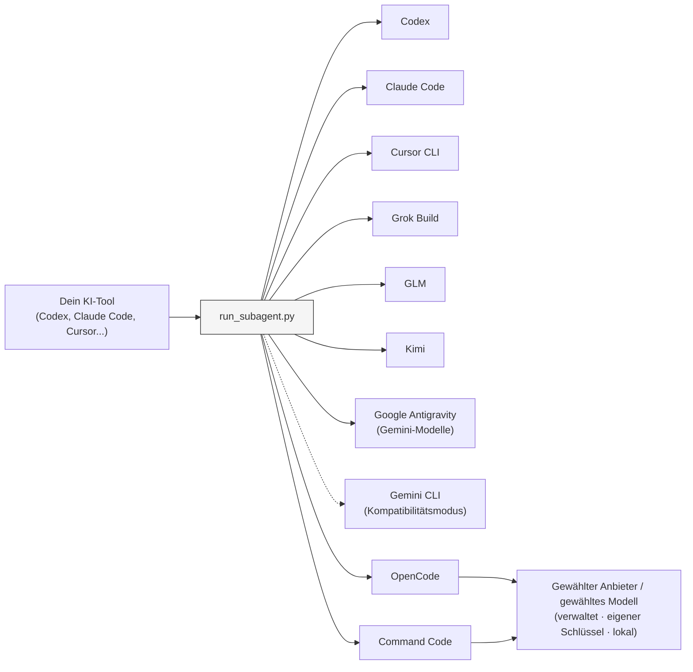

# Sub-Agents Skills

[English](README.md) | [简体中文](README.zh-CN.md) | [Русский](README.ru.md) | Deutsch | [Español](README.es.md)

[](https://developers.openai.com/codex/cli)
[](https://claude.ai/code)
[](https://www.kimi.com/code/en)
[](https://agentskills.io)
[](https://opensource.org/licenses/MIT)

Führe mit einem einzigen übergeordneten Tool spezialisierte Agenten auf unterschiedlichen KI-Coding-Backends aus.

Beschreibe einen Agenten einmal in Markdown und wähle anschließend das Backend, das ihn ausführt. Implementierung, Review, Analyse und Verifikation lassen sich so an verschiedene Coding-Tools delegieren, ohne die Agentendefinition zu duplizieren.

Der Skill selbst entspricht dem [Agent-Skills-Standard](https://agentskills.io). Die von ihm ausgeführten Agenten liegen als Markdown-Dateien unter `.agents/`.


## Schnellstart

**Voraussetzungen:** Python 3.9 oder neuer und mindestens ein installiertes [unterstütztes Backend](#supported-backends).

### 1. Skill installieren

**Codex (Plugin):**

```sh
codex plugin marketplace add shinpr/sub-agents-skills
```

Öffne anschließend die Plugin-Auswahl, installiere `Runner` und starte Codex neu:

```text
/plugins
```

Nach dem Neustart rufst du den Skill mit `$runner:sub-agents` auf.

**Claude Code (Plugin):**

```text
/plugin marketplace add shinpr/sub-agents-skills
/plugin install runner@sub-agents-skills
/reload-plugins
```

**Grok Build (Plugin):**

```sh
grok plugin marketplace add shinpr/sub-agents-skills
grok plugin install runner --trust
```

**Google Antigravity (Plugin):**

```sh
agy plugin install https://github.com/shinpr/sub-agents-skills/tree/main/plugins/runner
```

**Andere Clients (Cursor CLI, VS Code usw.):**

Kopiere den Skill mit dem Installationsskript in das Skill-Verzeichnis des jeweiligen Clients:

```bash
# Cursor
curl -fsSL https://raw.githubusercontent.com/shinpr/sub-agents-skills/main/install.sh | bash -s -- --target ~/.cursor/skills

# VS Code / Copilot (projektbezogen)
curl -fsSL https://raw.githubusercontent.com/shinpr/sub-agents-skills/main/install.sh | bash -s -- --target .github/skills

# Gemini CLI
curl -fsSL https://raw.githubusercontent.com/shinpr/sub-agents-skills/main/install.sh | bash -s -- --target ~/.gemini/skills
```

Alternativ kannst du das Repository klonen und den Skill manuell installieren:

```bash
git clone https://github.com/shinpr/sub-agents-skills.git
cd sub-agents-skills
./install.sh --target <client-skill-path>
```

### 2. Ersten Agenten anlegen

Lege in deinem Projekt das Verzeichnis `.agents/` an und erstelle darin `code-reviewer.md`:

```markdown
---
run-agent: codex
permission: read-only
---

# Code-Reviewer

Prüfe den Code auf Qualitäts- und Wartbarkeitsprobleme.

## Aufgabe
- Fehler und mögliche Probleme finden
- Verbesserungen vorschlagen
- Einheitlichen Codestil prüfen

## Fertig, wenn
- Alle Zieldateien geprüft wurden
- Alle Probleme mit Begründung aufgelistet sind
```

Das Feld `run-agent` im Frontmatter bestimmt, welches Backend den Agenten ausführt. Weitere Hinweise zum Aufbau findest du unter [Agenten schreiben](#writing-agents).

### 3. Agenten ausführen

Gib deinem übergeordneten KI-Tool folgende Anweisung:

```text
Verwende den Agenten code-reviewer, um die Änderungen an der Authentifizierung zu prüfen.
```

Das übergeordnete Tool ruft den Agenten über das gewählte Backend auf und gibt dessen Ergebnis zurück.

## Wozu dient das?

Bei den meisten KI-Coding-Tools sind Subagenten an die Modelle des jeweiligen Anbieters gebunden: Claude Code delegiert an Claude, Codex an GPT. Die eingebauten Delegationsmechanismen bieten keine portable Möglichkeit, eine Aufgabe an das Modell eines anderen Anbieters weiterzugeben.

Sub-Agents Skills trennt die Rolle eines Agenten von seinem Ausführungs-Backend. Die Markdown-Datei beschreibt, was der Agent tut; `run-agent` legt fest, wo er ausgeführt wird. Beim Wechsel des Backends müssen Rolle, Aufgabe und Ausgabevorgaben nicht neu geschrieben werden.

Da der Runner als Agent Skill ausgeliefert wird, können dieselben Definitionen aus `.agents/` in verschiedenen unterstützten übergeordneten Tools verwendet werden.

## Anwendungsbeispiele

Nenne beim Aufruf eines Agenten die konkrete Aufgabe:

```text
Verwende den Agenten code-reviewer, um meine Klasse UserService zu prüfen.
```

```text
Verwende den Agenten test-writer, um Unit-Tests für das Modul auth zu erstellen.
```

```text
Verwende den Agenten doc-writer, um alle öffentlichen Methoden mit JSDoc-Kommentaren zu versehen.
```

### Mehrere Backends in einem Projekt

Agenten mit unterschiedlichen Backends können nebeneinander liegen:

```text
.agents/
├── test-writer.md         # run-agent: codex
├── code-reviewer.md       # run-agent: claude
├── kimi-implementer.md    # run-agent: kimi
└── alternate-reviewer.md  # run-agent: grok
```

```text
Führe die Agenten code-reviewer und alternate-reviewer parallel aus und übergib die übereinstimmenden Änderungen anschließend an kimi-implementer.
```

Nenne sowohl den Agenten als auch seine Aufgabe. Der Name allein sagt nicht, was erledigt werden soll.

<a id="supported-backends"></a>
## Unterstützte Backends

Setze `run-agent` in jeder Agentendefinition. Der Wert bestimmt das Backend; einige Backends verwenden dieselbe ausführbare Datei.

| `run-agent` | Backend | Ausgeführtes CLI |
|-------------|---------|------------------|
| `codex` | Codex | `codex` |
| `claude` | Claude Code | `claude` |
| `cursor-agent` | Cursor CLI | `cursor-agent` |
| `glm` | GLM (Z.ai) | `claude` mit dem Z.ai-Endpunkt |
| `kimi` | Kimi | `claude` mit dem Kimi-Endpunkt |
| `grok` | Grok Build | `grok` |
| `antigravity` | Google Antigravity | `agy` |
| `gemini` | Gemini CLI (Kompatibilitätsmodus) | `gemini` |
| `opencode` | OpenCode | `opencode` |
| `command-code` | Command Code | `command-code` |

Installiere nur die CLIs, die du tatsächlich verwenden möchtest. Für Google-Modelle wird Antigravity CLI 1.1.12 oder neuer empfohlen; vorhandene Gemini-CLI-Konfigurationen werden weiterhin unterstützt.

<a id="writing-agents"></a>
## Agenten schreiben

Agentendefinitionen sind `.md`- oder `.txt`-Dateien im Verzeichnis `.agents/`. Im Normalfall steht `run-agent` im YAML-Frontmatter und die Aufgabenbeschreibung im Dateitext.

```markdown
---
run-agent: claude
model: opus
effort: high
permission: safe-edit
---

# Name des Agenten

Beschreibe seinen Zweck in einem Satz.

## Aufgabe
- Aktion 1
- Aktion 2

## Fertig, wenn
- Kriterium 1
- Kriterium 2
```

<details>
<summary>Frontmatter-Referenz</summary>

### Frontmatter-Felder

| Feld | Werte | Beschreibung |
|------|-------|--------------|
| `run-agent` | `codex`, `claude`, `cursor-agent`, `glm`, `kimi`, `grok`, `antigravity`, `gemini`, `opencode`, `command-code` | Backend, das den Agenten ausführt |
| `model` | Backendspezifischer Modellname (optional) | Wird an das gewählte CLI übergeben; ohne Angabe gilt dessen konfigurierter Standard |
| `effort` | Vom Backend und Modell unterstützter Wert (optional) | Überschreibt den Reasoning-Effort; ohne Angabe gilt der Standardwert |
| `permission` | `read-only`, `safe-edit` (Standard), `yolo` | Bestätigungs- und Sandbox-Stufe des Subagenten |

`run-agent` ist erforderlich, sofern das Backend nicht für einen einzelnen Aufruf mit `--cli` überschrieben wird.

`effort` wird unverändert an das gewählte Backend weitergegeben. Welche Werte zulässig sind, hängt von Backend und Modell ab; prüfe dies in der Dokumentation des Anbieters. Ungültige Kombinationen schlagen zur Laufzeit fehl. Cursor und Gemini unterstützen dieses Feld nicht.

**Berechtigungsstufen:**

- `read-only`: nur Untersuchung und Review, keine Dateiänderungen oder schreibenden Shell-Befehle (codex `-s read-only` / claude `--permission-mode plan` / cursor `--mode plan --sandbox enabled` / grok `--sandbox read-only` / antigravity `--mode plan --sandbox` / gemini `--approval-mode plan` / OpenCode-Regeln, die Schreibzugriffe verweigern / Plan-Modus von Command Code)
- `safe-edit`: nicht interaktiver Standardmodus zum Bearbeiten (codex `-s workspace-write` + `approval_policy=never` / claude `--permission-mode acceptEdits` / cursor `--trust --sandbox enabled` / grok `--sandbox workspace` / antigravity `--mode accept-edits --sandbox` / gemini `--approval-mode auto_edit` / Runner-Regeln für OpenCode und Command Code)
- `yolo`: umgeht alle Bestätigungen und Sandbox-Beschränkungen; verwende diesen Modus nur für vertrauenswürdige Aufgaben und Umgebungen.

Subagenten haben keine Standardeingabe. Der Runner startet die Backends deshalb in einem nicht interaktiven Modus. Die Berechtigungsoptionen der verschiedenen CLIs sind nicht gleichwertig; die tatsächliche Isolation hängt vom jeweiligen Tool ab. Bei Cursor führt die Sandbox beispielsweise unterstützte Shell-Befehle isoliert aus, während `--mode plan` den Nur-Lese-Modus vorgibt.

</details>

<details>
<summary>Hinweise zum Schreiben von Agenten</summary>

### Eine Aufgabe pro Agent

Gib jedem Agenten genau eine Verantwortung. Wenn Review, Implementierung und Testerstellung unterschiedliche Anweisungen oder Berechtigungen benötigen, teile sie auf mehrere Agenten auf.

### Eigenständige Agentendefinitionen

Agenten laufen isoliert und beginnen jeweils mit einem neuen Kontext. Vermeide daher:

- Verweise auf andere Agenten („verwende danach Agent X“);
- Annahmen über vorherigen Kontext („mache dort weiter, wo wir aufgehört haben“);
- Aufgaben außerhalb der beschriebenen Verantwortung.

### Zusätzliche Abschnitte

Ergänze bei Bedarf:

- **Abgrenzung**: Was ausdrücklich nicht zur Aufgabe gehört;
- **Verbotene Aktionen**: Typische Fehler, die vermieden werden müssen;
- **Ausgabeformat**: Eine feste Struktur, wenn der Empfänger sie benötigt.

</details>

<details>
<summary>Vollständiges Agentenbeispiel</summary>

Jede `.md`- oder `.txt`-Datei im Verzeichnis `.agents/` wird zu einem Agenten. Der Dateiname ist zugleich der Agentenname; `bug-investigator.md` ergibt beispielsweise den Agenten `bug-investigator`.

**`bug-investigator.md`**
```markdown
---
run-agent: codex
permission: read-only
---

# Fehleranalyst

Untersuche Fehlerberichte und bestimme ihre eigentliche Ursache.

## Aufgabe
- Belege aus Fehlerprotokollen, Code und Git-Verlauf sammeln
- Mehrere mögliche Ursachen formulieren
- Jede Hypothese bis zur eigentlichen Ursache zurückverfolgen
- Ergebnisse mit den zugehörigen Belegen festhalten

## Nicht Teil der Aufgabe
- Den Fehler beheben — dieser Agent untersucht ihn nur
- Annahmen ohne Belege treffen

## Fertig, wenn
- Mindestens zwei Hypothesen mit Belegen dokumentiert sind
- Die wahrscheinlichste Ursache mit Konfidenz angegeben ist
- Die betroffenen Codestellen aufgelistet sind
```

Weiterführende Muster wie Abschluss-Checklisten, verbotene Aktionen und strukturierte Ausgaben findest du unter [claude-code-workflows/agents](https://github.com/shinpr/claude-code-workflows/tree/main/agents).

</details>

## Konfigurationsreferenz

<details>
<summary>Speicherort der Agenten und Backend-Auswahl</summary>

### Speicherort der Agentendefinitionen

| Priorität | Quelle | Pfad |
|-----------|--------|------|
| 1 | Argument `--agents-dir` | Explizit angegebener Pfad |
| 2 | Umgebungsvariable | `$SUB_AGENTS_DIR` |
| 3 | Standard | `{cwd}/.agents/` |

Benutzerdefinierter Pfad: `export SUB_AGENTS_DIR=/custom/path`

### Priorität der CLI-Auswahl

1. Argument `--cli` — explizite Überschreibung für einen Aufruf
2. Feld `run-agent` im Frontmatter der Agentendefinition
3. Fehler, wenn beides fehlt

`--cli` hat immer Vorrang vor `run-agent` aus der Agentendefinition. Bei normalen Aufrufen lässt du das Argument weg.

</details>

<details>
<summary>Parameter für den direkten Runner-Aufruf</summary>

### Skriptparameter

| Parameter | Erforderlich | Beschreibung |
|-----------|--------------|--------------|
| `--list` | Nein | Verfügbare Agenten auflisten; keine weiteren Parameter erforderlich |
| `--agent` | Ja* | Name einer Agentendefinition aus `--list` |
| `--prompt` | Ja* | Beschreibung der zu delegierenden Aufgabe |
| `--cwd` | Ja* | Arbeitsverzeichnis als absoluter Pfad |
| `--timeout` | Nein | Zeitlimit in Millisekunden, Standard: 600000 |
| `--cli` | Nein | CLI erzwingen: `codex`, `claude`, `cursor-agent`, `glm`, `kimi`, `grok`, `antigravity`, `gemini`, `opencode`, `command-code` |

\* Erforderlich, wenn `--list` nicht verwendet wird.

</details>

## Backend-Einrichtung

Die meisten Backends verwenden die vorhandene Authentifizierung ihres CLI. Die folgenden Backends benötigen zusätzliche Routing- oder Anbieterangaben.

<a id="glm-zai"></a>
<details>
<summary>GLM (Z.ai)</summary>

Das Backend `glm` verwendet Claude Code mit dem Anthropic-kompatiblen GLM-Endpunkt. Installiere Claude Code und setze anschließend dein Z.ai-Token:

```bash
export GLM_API_KEY=<your-z.ai-token>
```

Der Runner übergibt den Schlüssel an die Umgebung des Kindprozesses und leitet Claude Code an `https://api.z.ai/api/anthropic` weiter.

</details>

<a id="kimi"></a>
<details>
<summary>Kimi</summary>

Das Backend `kimi` verwendet Claude Code mit dem Coding-Endpunkt von Kimi. Installiere Claude Code und setze anschließend deinen Kimi-API-Schlüssel:

```bash
export KIMI_API_KEY=<your-kimi-api-key>
```

Der Runner übergibt den Schlüssel an die Umgebung des Kindprozesses und leitet Claude Code an `https://api.kimi.com/coding/` weiter.

Anbieterspezifische Schlüssel haben Vorrang, sodass mehrere Backends gleichzeitig konfiguriert bleiben können:

```bash
export GLM_API_KEY=<your-z.ai-token>
export KIMI_API_KEY=<your-kimi-api-key>
export CURSOR_API_KEY=<your-cursor-token> # optional, wenn cursor-agent bereits angemeldet ist
```

</details>

<a id="opencode"></a>
<details>
<summary>OpenCode</summary>

Das Backend `opencode` verwendet das Modell aus der Agentendefinition. Fehlt `model`, gilt der in OpenCode konfigurierte Standard. Über OpenCode kann ein Agent auf unterstützten Anbietern, OpenAI-kompatiblen APIs, Gateways oder lokalen Modellen ausgeführt werden.

Konfiguriere OpenCode in `~/.config/opencode/opencode.json` oder in der projektbezogenen Datei `opencode.json`. Gib ein Modell im Format „Anbieter/Modell“ an:

```markdown
---
run-agent: opencode
model: provider/model-id
effort: provider-variant
permission: safe-edit
---
```

Der Runner übergibt `model` mit `--model` und `effort` mit der OpenCode-Option `--variant`.

</details>

<a id="command-code"></a>
<details>
<summary>Command Code</summary>

Installiere Command Code und konfiguriere ein Modell. Melde dich für von Command Code bereitgestellte Modelle mit `command-code login` an; Modell-IDs listet `command-code --list-models` auf. Setze `run-agent: command-code`; `model` und `effort` sind optional.

</details>

## Sicherheit

Agentendefinitionen dienen als System-Prompts und steuern direkt, was der Subagent tut. Eine bösartige Definition könnte den Subagenten anweisen, vertrauliche Dateien zu lesen, schädliche Befehle auszuführen oder Daten nach außen zu übertragen.

Verwende nur selbst geschriebene Agentendefinitionen oder Definitionen aus vertrauenswürdigen Quellen. Prüfe jede fremde Definition, bevor du sie ausführst.

## Funktionsweise

Das übergeordnete Tool liest die installierte `SKILL.md` und erfährt daraus, wie es den Runner aufruft. Der Runner lädt die ausgewählte Definition aus `.agents/*.md`, ruft das dort konfigurierte Backend auf und gibt das Ergebnis dieses Aufrufs an das übergeordnete Tool zurück.



```text
skills/sub-agents/
├── SKILL.md              # Anweisungen für das übergeordnete Tool
├── scripts/
│   └── run_subagent.py   # Ruft externe CLIs auf
└── references/
    └── codex.md          # Hostspezifische Einrichtungshinweise
```

### Getrennte Kontexte

Jeder Aufruf eines Subagenten beginnt eine neue Unterhaltung. Subagenten übernehmen den Chatverlauf anderer Subagenten nicht. Sie verwenden jedoch dasselbe ausgewählte Arbeitsverzeichnis und können die darin enthaltenen Dateien sehen.

Das übergeordnete Tool erhält das Endergebnis des Runners, nicht den vollständigen Gesprächsverlauf des Subagenten. Jeder Aufruf startet einen eigenen CLI-Prozess und bringt eigenen Startaufwand mit sich.

## Fehlerbehebung

### Zeitüberschreitung oder Authentifizierungsfehler

**Codex / Claude Code:**
Stelle sicher, dass das CLI installiert und über `PATH` erreichbar ist.

**Cursor CLI:**
Melde dich mit `cursor-agent login` an oder setze `CURSOR_API_KEY`. Sitzungen können ablaufen; melde dich bei einem Authentifizierungsfehler erneut an.

**GLM:**
Setze `GLM_API_KEY`; siehe [GLM (Z.ai)](#glm-zai).

**Kimi:**
Installiere Claude Code und setze `KIMI_API_KEY`; siehe [Kimi](#kimi).

**Google:**
Führe vor der Verwendung des Backends `antigravity` einmal `agy` zur Anmeldung aus. Setze für das Gemini-CLI-Backend stattdessen `GEMINI_API_KEY` in der Umgebung.

**OpenCode:**
Installiere OpenCode und konfiguriere einen Anbieter sowie ein Standardmodell. Führe vor der Verwendung `opencode models` und anschließend einen direkten Probelauf mit `opencode run --format json` aus.

**Command Code:**
Installiere Command Code und konfiguriere ein Modell. Prüfe die Authentifizierung mit `command-code status`.

### Agent nicht gefunden

Prüfe Folgendes:

- Die Agentendatei liegt im Verzeichnis `.agents/` oder im Verzeichnis aus `SUB_AGENTS_DIR`.
- Die Datei hat die Endung `.md` oder `.txt`.
- Der Dateiname enthält Bindestriche oder Unterstriche, aber keine Leerzeichen.

### CLI nicht gefunden (Exit-Code 127)

Installiere das benötigte CLI:

- Codex: `npm install -g @openai/codex`
- Claude Code: `curl -fsSL https://claude.ai/install.sh | bash`
- Cursor CLI: `curl https://cursor.com/install -fsS | bash`
- Grok Build: `curl -fsSL https://x.ai/cli/install.sh | bash`
- Google Antigravity: `curl -fsSL https://antigravity.google/cli/install.sh | bash`
- OpenCode: `brew install anomalyco/tap/opencode`
- Command Code: `npm install -g command-code`

Installiere Gemini CLI bei Bedarf mit `npm install -g @google/gemini-cli`.

### Andere Ausführungsfehler

1. Prüfe, ob das Frontmatter der Agentendefinition einen gültigen Wert für `run-agent` enthält.
2. Stelle sicher, dass das gewählte CLI installiert und erreichbar ist.
3. Prüfe, ob `--cwd` ein absoluter Pfad zu einem vorhandenen Verzeichnis ist.

## Lizenz

MIT
