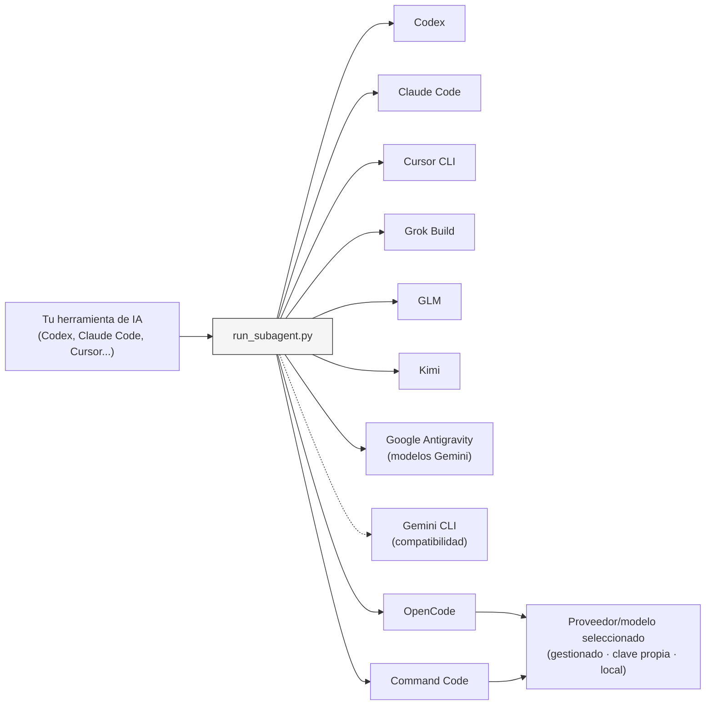

# Sub-Agents Skills

[English](README.md) | [简体中文](README.zh-CN.md) | [Русский](README.ru.md) | [Deutsch](README.de.md) | Español

[](https://developers.openai.com/codex/cli)
[](https://claude.ai/code)
[](https://www.kimi.com/code/en)
[](https://agentskills.io)
[](https://opensource.org/licenses/MIT)

Ejecuta agentes especializados en distintos backends de programación con IA desde una sola herramienta principal.

Define cada agente una sola vez en Markdown y elige después el backend que lo ejecutará. Así puedes delegar implementación, revisión, investigación y verificación a distintas herramientas sin duplicar la definición del agente.

El skill cumple el estándar [Agent Skills](https://agentskills.io). Los agentes que ejecuta se guardan como archivos Markdown dentro de `.agents/`.


## Inicio rápido

**Requisitos:** Python 3.9 o posterior y al menos uno de los [backends compatibles](#supported-backends) instalado.

### 1. Instala el skill

**Codex (plugin):**

```sh
codex plugin marketplace add shinpr/sub-agents-skills
```

Abre el selector de plugins, instala `Runner` y reinicia Codex:

```text
/plugins
```

Después del reinicio, invoca el skill como `$runner:sub-agents`.

**Claude Code (plugin):**

```text
/plugin marketplace add shinpr/sub-agents-skills
/plugin install runner@sub-agents-skills
/reload-plugins
```

**Grok Build (plugin):**

```sh
grok plugin marketplace add shinpr/sub-agents-skills
grok plugin install runner --trust
```

**Google Antigravity (plugin):**

```sh
agy plugin install https://github.com/shinpr/sub-agents-skills/tree/main/plugins/runner
```

**Otros clientes (Cursor CLI, VS Code, etc.):**

Usa el script de instalación para copiar el skill al directorio correspondiente del cliente:

```bash
# Cursor
curl -fsSL https://raw.githubusercontent.com/shinpr/sub-agents-skills/main/install.sh | bash -s -- --target ~/.cursor/skills

# VS Code / Copilot (solo para el proyecto actual)
curl -fsSL https://raw.githubusercontent.com/shinpr/sub-agents-skills/main/install.sh | bash -s -- --target .github/skills

# Gemini CLI
curl -fsSL https://raw.githubusercontent.com/shinpr/sub-agents-skills/main/install.sh | bash -s -- --target ~/.gemini/skills
```

También puedes clonar el repositorio e instalarlo manualmente:

```bash
git clone https://github.com/shinpr/sub-agents-skills.git
cd sub-agents-skills
./install.sh --target <client-skill-path>
```

### 2. Crea tu primer agente

Crea un directorio `.agents/` en tu proyecto y añade `code-reviewer.md`:

```markdown
---
run-agent: codex
permission: read-only
---

# Revisor de código

Revisa el código en busca de problemas de calidad y mantenibilidad.

## Tarea
- Encontrar errores y posibles problemas
- Proponer mejoras
- Comprobar la coherencia del estilo de código

## Criterios de finalización
- Todos los archivos objetivo han sido revisados
- Todos los problemas encontrados están enumerados y explicados
```

El campo `run-agent` del frontmatter indica qué backend ejecutará el agente. Consulta [Cómo definir agentes](#writing-agents) para conocer el resto de la estructura.

### 3. Ejecuta el agente

Dale esta instrucción a tu herramienta de IA principal:

```text
Usa el agente code-reviewer para revisar los cambios de autenticación.
```

La herramienta principal invoca el agente mediante el backend elegido y devuelve su resultado.

## ¿Para qué sirve?

La mayoría de las herramientas de programación con IA ofrecen subagentes vinculados a sus propios modelos: Claude Code delega en Claude y Codex en GPT. Sus mecanismos integrados no permiten enviar tareas a modelos de otros proveedores de forma independiente de la herramienta de origen.

Sub-Agents Skills separa la función del agente del backend que lo ejecuta. El archivo Markdown define qué debe hacer y `run-agent` determina dónde se ejecuta. Cambiar de backend no obliga a reescribir la función, la tarea ni el formato de salida.

Como el runner se distribuye en forma de Agent Skill, las mismas definiciones de `.agents/` se pueden utilizar desde distintas herramientas principales compatibles.

## Ejemplos de uso

Al invocar un agente, describe también la tarea:

```text
Usa el agente code-reviewer para revisar mi clase UserService.
```

```text
Usa el agente test-writer para crear pruebas unitarias para el módulo auth.
```

```text
Usa el agente doc-writer para añadir comentarios JSDoc a todos los métodos públicos.
```

### Combinar backends en un proyecto

Los agentes que usan distintos backends pueden convivir en el mismo directorio:

```text
.agents/
├── test-writer.md         # run-agent: codex
├── code-reviewer.md       # run-agent: claude
├── kimi-implementer.md    # run-agent: kimi
└── alternate-reviewer.md  # run-agent: grok
```

```text
Ejecuta los agentes code-reviewer y alternate-reviewer en paralelo y pasa después los cambios en los que coincidan a kimi-implementer.
```

Incluye tanto el nombre del agente como la tarea. El nombre por sí solo no indica qué debe hacer.

<a id="supported-backends"></a>
## Backends compatibles

Define `run-agent` en cada agente. Su valor determina el backend; algunos backends comparten el mismo ejecutable.

| `run-agent` | Backend | CLI ejecutada |
|-------------|---------|---------------|
| `codex` | Codex | `codex` |
| `claude` | Claude Code | `claude` |
| `cursor-agent` | Cursor CLI | `cursor-agent` |
| `glm` | GLM (Z.ai) | `claude` con el endpoint de Z.ai |
| `kimi` | Kimi | `claude` con el endpoint de Kimi |
| `grok` | Grok Build | `grok` |
| `antigravity` | Google Antigravity | `agy` |
| `gemini` | Gemini CLI (compatibilidad) | `gemini` |
| `opencode` | OpenCode | `opencode` |
| `command-code` | Command Code | `command-code` |

Instala únicamente las CLI que vayas a utilizar. Para los modelos de Google se recomienda Antigravity CLI 1.1.12 o posterior; las configuraciones existentes de Gemini CLI siguen siendo compatibles.

<a id="writing-agents"></a>
## Cómo definir agentes

Las definiciones de agentes son archivos `.md` o `.txt` dentro de `.agents/`. En el uso habitual, incluye `run-agent` en el frontmatter YAML y describe la tarea en el cuerpo del archivo.

```markdown
---
run-agent: claude
model: opus
effort: high
permission: safe-edit
---

# Nombre del agente

Describe su propósito en una frase.

## Tarea
- Acción 1
- Acción 2

## Criterios de finalización
- Criterio 1
- Criterio 2
```

<details>
<summary>Referencia del frontmatter</summary>

### Campos del frontmatter

| Campo | Valores | Descripción |
|-------|---------|-------------|
| `run-agent` | `codex`, `claude`, `cursor-agent`, `glm`, `kimi`, `grok`, `antigravity`, `gemini`, `opencode`, `command-code` | Backend que ejecuta el agente |
| `model` | Nombre de modelo específico del backend (opcional) | Se pasa a la CLI elegida; si se omite, se utiliza su valor configurado por defecto |
| `effort` | Valor admitido por el backend y el modelo (opcional) | Sobrescribe el nivel de razonamiento; si se omite, se utiliza el valor por defecto |
| `permission` | `read-only`, `safe-edit` (por defecto), `yolo` | Nivel de aprobación y aislamiento con el que se ejecuta el subagente |

`run-agent` es obligatorio salvo que `--cli` lo sobrescriba de forma explícita para una ejecución concreta.

`effort` se envía sin modificar al backend elegido. Los valores admitidos dependen del backend y del modelo, así que consulta la documentación del proveedor antes de definirlo. Las combinaciones no válidas fallan durante la ejecución. Cursor y Gemini no admiten este campo.

**Niveles de permisos:**

- `read-only`: solo investigación y revisión, sin edición de archivos ni comandos de shell que escriban (codex `-s read-only` / claude `--permission-mode plan` / cursor `--mode plan --sandbox enabled` / grok `--sandbox read-only` / antigravity `--mode plan --sandbox` / gemini `--approval-mode plan` / reglas de denegación de OpenCode / modo plan de Command Code)
- `safe-edit`: modo de edición no interactivo predeterminado (codex `-s workspace-write` + `approval_policy=never` / claude `--permission-mode acceptEdits` / cursor `--trust --sandbox enabled` / grok `--sandbox workspace` / antigravity `--mode accept-edits --sandbox` / gemini `--approval-mode auto_edit` / reglas del runner para OpenCode y Command Code)
- `yolo`: omite todas las aprobaciones y el aislamiento; úsalo únicamente con tareas y entornos de confianza.

Los subagentes no tienen entrada estándar, por lo que el runner usa los modos no interactivos de cada backend. Las opciones de permisos de las distintas CLI no son equivalentes; el aislamiento real depende de cada herramienta. Por ejemplo, el sandbox de Cursor ejecuta los comandos de shell compatibles dentro de un entorno aislado, mientras que `--mode plan` establece la restricción de solo lectura.

</details>

<details>
<summary>Recomendaciones para definir agentes</summary>

### Un cometido por agente

Asigna una sola responsabilidad a cada agente. Separa la revisión, la implementación y la generación de pruebas cuando necesiten instrucciones o permisos diferentes.

### Definiciones autosuficientes

Los agentes se ejecutan de forma aislada y con un contexto nuevo. Evita:

- hacer referencia a otros agentes («después usa el agente X»);
- suponer que conocen el contexto de una ejecución anterior («continúa desde donde lo dejamos»);
- incluir tareas ajenas a su responsabilidad declarada.

### Secciones adicionales

Añade estas secciones cuando sean necesarias:

- **Límites del alcance**: indica expresamente qué queda fuera;
- **Acciones prohibidas**: enumera errores habituales que el agente debe evitar;
- **Formato de salida**: define una estructura cuando el destinatario la necesite.

</details>

<details>
<summary>Ejemplo completo de un agente</summary>

Cada archivo `.md` o `.txt` dentro de `.agents/` se convierte en un agente. El nombre del archivo pasa a ser el nombre del agente; por ejemplo, `bug-investigator.md` crea el agente `bug-investigator`.

**`bug-investigator.md`**
```markdown
---
run-agent: codex
permission: read-only
---

# Investigador de errores

Investiga informes de errores e identifica sus causas raíz.

## Tarea
- Recopilar evidencias de registros de errores, código e historial de Git
- Formular varias hipótesis sobre la causa
- Seguir cada hipótesis hasta su causa raíz
- Presentar las conclusiones junto con las evidencias

## Fuera del alcance
- Corregir el error: este agente solo investiga
- Hacer suposiciones sin evidencias

## Criterios de finalización
- Se han documentado al menos dos hipótesis con evidencias
- Se ha identificado la causa más probable y el nivel de confianza
- Se han enumerado las ubicaciones de código afectadas
```

Para patrones más avanzados —listas de comprobación, acciones prohibidas y salidas estructuradas— consulta [claude-code-workflows/agents](https://github.com/shinpr/claude-code-workflows/tree/main/agents).

</details>

## Referencia de configuración

<details>
<summary>Ubicación de los agentes y selección del backend</summary>

### Ubicación de las definiciones

| Prioridad | Origen | Ruta |
|-----------|--------|------|
| 1 | Argumento `--agents-dir` | Ruta indicada explícitamente |
| 2 | Variable de entorno | `$SUB_AGENTS_DIR` |
| 3 | Valor predeterminado | `{cwd}/.agents/` |

Para cambiarla: `export SUB_AGENTS_DIR=/custom/path`

### Prioridad para elegir la CLI

1. Argumento `--cli`: sobrescritura explícita para una sola ejecución
2. Campo `run-agent` del frontmatter del agente
3. Error si no se especifica ninguno

`--cli` siempre tiene prioridad sobre el `run-agent` de la definición. Omítelo en las ejecuciones habituales.

</details>

<details>
<summary>Parámetros para invocar directamente el runner</summary>

### Parámetros del script

| Parámetro | Obligatorio | Descripción |
|-----------|-------------|-------------|
| `--list` | No | Enumera los agentes disponibles; no necesita otros parámetros |
| `--agent` | Sí* | Nombre de una definición incluida en `--list` |
| `--prompt` | Sí* | Descripción de la tarea que se delegará |
| `--cwd` | Sí* | Directorio de trabajo como ruta absoluta |
| `--timeout` | No | Tiempo límite en milisegundos; valor predeterminado: 600000 |
| `--cli` | No | Fuerza una CLI: `codex`, `claude`, `cursor-agent`, `glm`, `kimi`, `grok`, `antigravity`, `gemini`, `opencode`, `command-code` |

\* Obligatorio cuando no se utiliza `--list`.

</details>

## Configuración de los backends

La mayoría de los backends utilizan la autenticación existente de su CLI. Los siguientes necesitan configuración adicional de enrutamiento o proveedor.

<a id="glm-zai"></a>
<details>
<summary>GLM (Z.ai)</summary>

El backend `glm` ejecuta Claude Code utilizando el endpoint de GLM compatible con Anthropic. Instala Claude Code y define tu token de Z.ai:

```bash
export GLM_API_KEY=<your-z.ai-token>
```

El runner pasa la clave al entorno del proceso hijo y dirige Claude Code a `https://api.z.ai/api/anthropic`.

</details>

<a id="kimi"></a>
<details>
<summary>Kimi</summary>

El backend `kimi` ejecuta Claude Code utilizando el endpoint de programación de Kimi. Instala Claude Code y define tu clave de API de Kimi:

```bash
export KIMI_API_KEY=<your-kimi-api-key>
```

El runner pasa la clave al entorno del proceso hijo y dirige Claude Code a `https://api.kimi.com/coding/`.

Las claves específicas de proveedor tienen prioridad, por lo que puedes mantener varios backends configurados a la vez:

```bash
export GLM_API_KEY=<your-z.ai-token>
export KIMI_API_KEY=<your-kimi-api-key>
export CURSOR_API_KEY=<your-cursor-token> # opcional si cursor-agent ya tiene una sesión iniciada
```

</details>

<a id="opencode"></a>
<details>
<summary>OpenCode</summary>

El backend `opencode` utiliza el modelo indicado en la definición del agente. Si se omite `model`, usa el valor predeterminado configurado en OpenCode. A través de OpenCode, un agente puede ejecutarse con proveedores compatibles, API compatibles con OpenAI, gateways o modelos locales.

Configura OpenCode en `~/.config/opencode/opencode.json` o en el archivo `opencode.json` del proyecto. Para seleccionar un modelo, usa el formato «proveedor/modelo»:

```markdown
---
run-agent: opencode
model: provider/model-id
effort: provider-variant
permission: safe-edit
---
```

El runner pasa `model` mediante `--model` y `effort` mediante la opción `--variant` de OpenCode.

</details>

<a id="command-code"></a>
<details>
<summary>Command Code</summary>

Instala Command Code y configura un modelo. Usa `command-code login` para los modelos alojados por Command Code y `command-code --list-models` para consultar sus identificadores. Define `run-agent: command-code`; `model` y `effort` son opcionales.

</details>

## Seguridad

Las definiciones de agentes funcionan como prompts de sistema y controlan directamente lo que hace el subagente. Una definición maliciosa podría ordenarle leer archivos confidenciales, ejecutar comandos dañinos o enviar datos fuera del entorno.

Utiliza únicamente definiciones escritas por ti o procedentes de fuentes de confianza. Revisa cualquier definición de terceros antes de ejecutarla.

## Cómo funciona

La herramienta principal lee el archivo `SKILL.md` instalado para saber cómo invocar el runner. Este carga la definición seleccionada de `.agents/*.md`, llama al backend configurado y devuelve a la herramienta principal el resultado de esa ejecución.



```text
skills/sub-agents/
├── SKILL.md              # Instrucciones para la herramienta principal
├── scripts/
│   └── run_subagent.py   # Invoca las CLI externas
└── references/
    └── codex.md          # Notas de configuración específicas del host
```

### Contextos independientes

Cada invocación de un subagente comienza una conversación nueva. Los subagentes no heredan el historial de chat de otros subagentes, pero usan el mismo directorio de trabajo seleccionado y pueden ver sus archivos.

La herramienta principal recibe el resultado final del runner, no el historial completo de la conversación del subagente. Cada invocación inicia un proceso de CLI independiente y añade su propia sobrecarga de arranque.

## Solución de problemas

### Tiempo de espera agotado o fallos de autenticación

**Codex / Claude Code:**
Comprueba que la CLI esté instalada y disponible en `PATH`.

**Cursor CLI:**
Ejecuta `cursor-agent login` o define `CURSOR_API_KEY`. Las sesiones pueden caducar; si aparece un error de autenticación, vuelve a iniciar sesión.

**GLM:**
Define `GLM_API_KEY`; consulta [GLM (Z.ai)](#glm-zai).

**Kimi:**
Instala Claude Code y define `KIMI_API_KEY`; consulta [Kimi](#kimi).

**Google:**
Ejecuta `agy` una vez para autenticarte antes de usar el backend `antigravity`. Si usas el backend de Gemini CLI, define `GEMINI_API_KEY` en el entorno.

**OpenCode:**
Instala OpenCode y configura un proveedor y un modelo predeterminado. Antes de utilizarlo, ejecuta `opencode models` y después una prueba rápida (smoke test) con `opencode run --format json`.

**Command Code:**
Instala Command Code y configura un modelo. Comprueba la autenticación con `command-code status`.

### No se encuentra el agente

Comprueba lo siguiente:

- El archivo del agente está dentro de `.agents/` o en el directorio indicado por `SUB_AGENTS_DIR`.
- La extensión es `.md` o `.txt`.
- El nombre utiliza guiones o guiones bajos, pero no espacios.

### No se encuentra la CLI (código de salida 127)

Instala la CLI necesaria:

- Codex: `npm install -g @openai/codex`
- Claude Code: `curl -fsSL https://claude.ai/install.sh | bash`
- Cursor CLI: `curl https://cursor.com/install -fsS | bash`
- Grok Build: `curl -fsSL https://x.ai/cli/install.sh | bash`
- Google Antigravity: `curl -fsSL https://antigravity.google/cli/install.sh | bash`
- OpenCode: `brew install anomalyco/tap/opencode`
- Command Code: `npm install -g command-code`

Si necesitas Gemini CLI, instálala con `npm install -g @google/gemini-cli`.

### Otros errores de ejecución

1. Comprueba que el frontmatter del agente incluya un valor válido de `run-agent`.
2. Asegúrate de que la CLI elegida esté instalada y disponible.
3. Comprueba que `--cwd` sea una ruta absoluta a un directorio existente.

## Licencia

MIT
