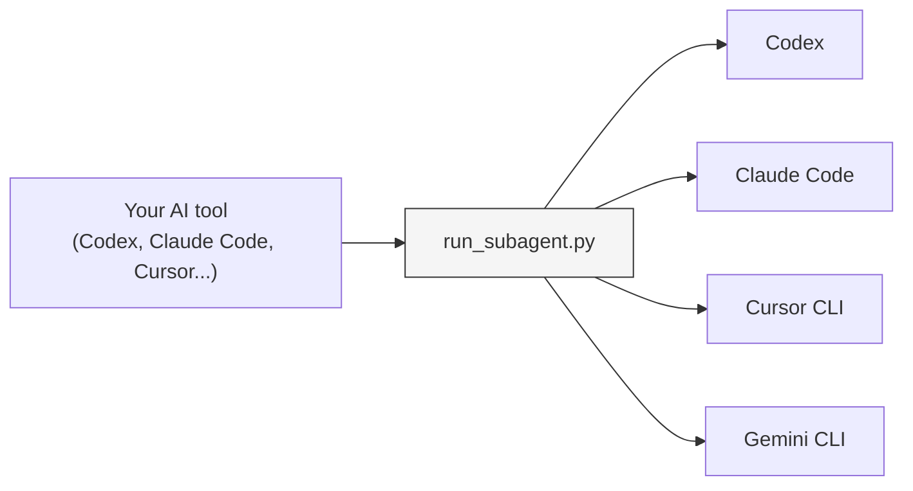

# Sub-Agents Skills

[](https://opensource.org/licenses/MIT)

**Orchestrate any LLM as a sub-agent from any AI coding tool.**

Use Codex, Claude Code, Cursor CLI, and Gemini CLI as sub-agents within a single workflow — regardless of which tool you're running. Define task-specific agents once in markdown, and execute them on any backend.



## Why?

Most major AI coding agents now have built-in sub-agents — but only for their own model. Claude Code delegates to Claude. Codex delegates to GPT. None of them let you call a competitor's model.

This skill removes that restriction:

- **Cross-LLM orchestration** — Use Codex for fast refactors, Claude Code for long-chain reasoning, and Gemini CLI for large-context analysis, all from the same parent session.
- **No vendor lock-in** — Your agent definitions are plain markdown files that work with Codex, Claude Code, Cursor CLI, Gemini CLI, VS Code, and [30+ other tools](https://agentskills.io) that support the Agent Skills format, so switching IDEs or LLM providers doesn't mean rewriting your workflow.
- **Bring Your Own Model** — Choose which model handles each task and pay each provider directly at their API rates.
- **Team portability** — Share agent definitions across your team regardless of IDE or preferred LLM.

<details>
<summary><strong>Coming from the MCP version?</strong></summary>

This repository replaces [sub-agents-mcp](https://github.com/shinpr/sub-agents-mcp) with a simpler approach: no server process, no Node.js dependency, just Python and file copies. If you're currently using the MCP version, migration is straightforward — your existing `.agents/` definitions work as-is.
</details>

## Supported Backends

Each agent definition specifies which CLI runs it via the `run-agent` frontmatter. You can mix backends freely within a project.

| Backend | CLI Command | Install |
|---------|-------------|---------|
| **Codex** (OpenAI) | `codex` | `npm install -g @openai/codex` |
| **Claude Code** (Anthropic) | `claude` | `curl -fsSL https://claude.ai/install.sh \| bash` |
| **Cursor** | `cursor-agent` | `curl https://cursor.com/install -fsS \| bash` |
| **Gemini** (Google) | `gemini` | `npm install -g @google/gemini-cli` |

You only need to install the backends you plan to use.

## Quick Start

**Requirements:** Python 3.9+ and at least one [supported backend](#supported-backends) installed.

### 1. Install the Skill

**Via curl:**
```bash
# For Codex
curl -fsSL https://raw.githubusercontent.com/shinpr/sub-agents-skills/main/install.sh | bash -s -- --target ~/.codex/skills

# For Claude Code
curl -fsSL https://raw.githubusercontent.com/shinpr/sub-agents-skills/main/install.sh | bash -s -- --target ~/.claude/skills
```

**Manually:**
```bash
git clone https://github.com/shinpr/sub-agents-skills.git
cd sub-agents-skills
./install.sh --target ~/.codex/skills
```

### 2. Create Your First Agent

Create a `.agents/` folder in your project and add `code-reviewer.md`:

```markdown
---
run-agent: codex
---

# Code Reviewer

Review code for quality and maintainability issues.

## Task
- Find bugs and potential issues
- Suggest improvements
- Check code style consistency

## Done When
- All target files reviewed
- Issues listed with explanations
```

The `run-agent` frontmatter specifies which CLI executes this agent. See [Writing Effective Agents](#writing-effective-agents) for more on agent design.

### 3. Fix "Permission Denied" Errors When Running Shell Commands

Sub-agents may fail to execute shell commands with permission errors. This happens because sub-agents can't respond to interactive permission prompts.

**Recommended approach:**

1. Run your CLI tool directly with the task you want sub-agents to handle:
   ```bash
   codex           # For Codex users
   claude          # For Claude Code users
   cursor-agent    # For Cursor CLI users
   gemini          # For Gemini CLI users
   ```

2. When prompted to allow commands (e.g., "Add Shell(cd), Shell(make) to allowlist?"), approve them

3. Approving updates your configuration file, so those commands will work when invoked via sub-agents

## Usage Examples

To run an agent, describe the task in your prompt:

```
"Use the code-reviewer agent to check my UserService class"
```

```
"Use the test-writer agent to create unit tests for the auth module"
```

```
"Use the doc-writer agent to add JSDoc comments to all public methods"
```

The host tool invokes the agent and returns results.

**Mixing backends in one project:**

You can have agents that use different LLMs side by side:

```
.agents/
├── test-writer.md      # run-agent: codex   (fast generation)
├── code-reviewer.md    # run-agent: claude  (strong reasoning)
└── doc-writer.md       # run-agent: gemini  (large context window)
```

```
"Use the code-reviewer agent to find security issues, then use the test-writer agent to add tests for the fixes"
```

**Tip:** Always include *what you want done* in your request—not just which agent to use. Specific prompts get better results.

## Writing Effective Agents

### The Single Responsibility Principle

Each agent should do **one thing well**. Avoid "swiss army knife" agents.

| Good | Bad |
|------|-----|
| Reviews code for security issues | Reviews code, writes tests, and refactors |
| Writes unit tests for a module | Writes tests and fixes bugs it finds |

### Essential Structure

```markdown
---
run-agent: codex
---

# Agent Name

One-sentence purpose.

## Task
- Action 1
- Action 2

## Done When
- Criterion 1
- Criterion 2
```

### Frontmatter Options

| Field | Values | Description |
|-------|--------|-------------|
| `run-agent` | `codex`, `claude`, `cursor-agent`, `gemini` | Which CLI executes this agent |

If `run-agent` is not specified, the skill auto-detects the caller environment or defaults to `codex`.

### Keep Agents Self-Contained

Agents run in isolation with fresh context. Avoid:

- References to other agents ("then use X agent...")
- Assumptions about prior context ("continuing from before...")
- Scope creep beyond the stated purpose

### Advanced Patterns

For complex agents, consider adding:

- **Scope boundaries**: Explicitly state what's *out of scope*
- **Prohibited actions**: List common mistakes the agent should avoid
- **Output format**: Define structured output when needed

## Agent Examples

Each `.md` or `.txt` file in your `.agents/` folder becomes an agent. The filename becomes the agent name (e.g., `bug-investigator.md` → "bug-investigator").

**`bug-investigator.md`**
```markdown
---
run-agent: codex
---

# Bug Investigator

Investigate bug reports and identify root causes.

## Task
- Collect evidence from error logs, code, and git history
- Generate multiple hypotheses for the cause
- Trace each hypothesis to its root cause
- Report findings with supporting evidence

## Out of Scope
- Fixing the bug (investigation only)
- Making assumptions without evidence

## Done When
- At least 2 hypotheses documented with evidence
- Most likely cause identified with confidence level
- Affected code locations listed
```

For more advanced patterns (completion checklists, prohibited actions, structured output), see [claude-code-workflows/agents](https://github.com/shinpr/claude-code-workflows/tree/main/agents).

## Configuration Reference

### Agent Definition Location

| Priority | Source | Path |
|----------|--------|------|
| 1 | `--agents-dir` argument | Explicit path |
| 2 | Environment variable | `$SUB_AGENTS_DIR` |
| 3 | Default | `{cwd}/.agents/` |

To customize: `export SUB_AGENTS_DIR=/custom/path`

### CLI Selection Priority

1. `--cli` argument (explicit override)
2. Agent definition `run-agent` frontmatter
3. Auto-detect caller environment
4. Default: `codex`

### Script Parameters

| Parameter | Required | Description |
|-----------|----------|-------------|
| `--list` | - | List available agents (no other params needed) |
| `--agent` | Yes* | Agent definition name from --list |
| `--prompt` | Yes* | Task description to delegate |
| `--cwd` | Yes* | Working directory (absolute path) |
| `--timeout` | No | Timeout ms (default: 600000) |
| `--cli` | No | Force CLI: `codex`, `claude`, `cursor-agent`, `gemini` |

*Required when not using --list

### Security Note

Agent definitions are system prompts that control what the sub-agent does. A malicious agent definition could instruct the sub-agent to read sensitive files, execute harmful commands, or exfiltrate data.

Only use agent definitions you've written yourself or from sources you trust. Review any third-party agent definitions before use.

## Troubleshooting

### Timeout errors or authentication failures

**If using Codex:**
Make sure the CLI is properly installed and accessible.

**If using Claude Code:**
Make sure the CLI is properly installed and accessible.

**If using Cursor CLI:**
Run `cursor-agent login` to authenticate. Sessions can expire, so just run this command again if you see auth errors.

**If using Gemini CLI:**
Run `gemini` once to authenticate via browser.

### Agent not found

Check that:
- Your agent file is in the `.agents/` directory (or path specified by `SUB_AGENTS_DIR`)
- The file has `.md` or `.txt` extension
- The filename uses hyphens or underscores (no spaces)

### CLI not found (exit code 127)

Install the required CLI:
- Codex: `npm install -g @openai/codex`
- Claude Code: `curl -fsSL https://claude.ai/install.sh | bash`
- Cursor CLI: `curl https://cursor.com/install -fsS | bash`
- Gemini CLI: `npm install -g @google/gemini-cli`

### Other execution errors

1. Verify the agent definition has valid `run-agent` frontmatter
2. Ensure your chosen CLI tool is installed and accessible
3. Check that `--cwd` is an absolute path to an existing directory

## Design Philosophy

### Why Independent Contexts?

Every sub-agent starts fresh. No shared state, no context from previous runs.

This means each call has some startup overhead, but you get predictable behavior—the same agent definition produces the same results regardless of what ran before. When you split a large task into sub-agents, each one focuses on its specific goal without interference from unrelated context.

The main agent stays lightweight too. It coordinates work without accumulating all the sub-agent context in its own window.

### Agent Skills as an Open Standard

This skill uses the [Agent Skills](https://agentskills.io) format—a convention for packaging reusable AI agent capabilities as portable files. The format is supported by Codex, Claude Code, Cursor CLI, Gemini CLI, and [30+ other tools](https://agentskills.io), so the same skill works across environments without modification.

## How It Works

Your AI reads the skill definition (SKILL.md), which tells it how to invoke the Python script. The script reads the agent definition (your `.agents/*.md` file), calls the appropriate CLI, and returns the result.

```
skills/sub-agents/
├── SKILL.md              # Instructions for the AI
├── scripts/
│   └── run_subagent.py   # Calls external CLIs
└── references/
    └── codex.md          # Codex-specific setup docs
```

## License

MIT
