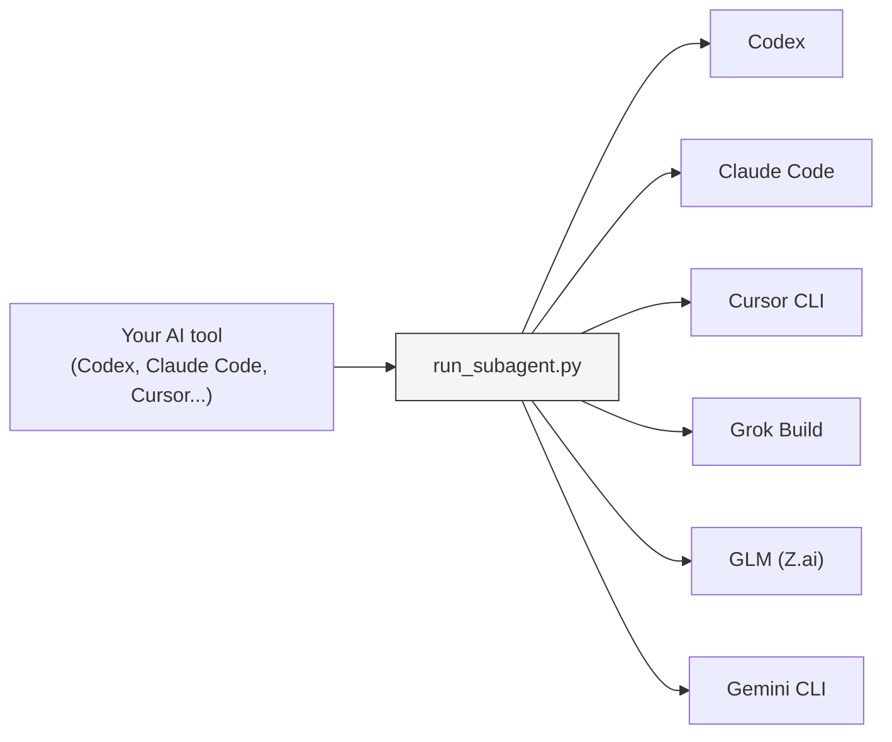

# Sub-Agents Skills

[](https://developers.openai.com/codex/cli)
[](https://claude.ai/code)
[](https://agentskills.io)
[](https://opensource.org/licenses/MIT)

**Orchestrate any LLM as a sub-agent from any AI coding tool.**

Use Codex, Claude Code, Cursor CLI, GLM (Z.ai), Grok Build, and Gemini CLI as sub-agents within a single workflow — regardless of which tool you're running. Define task-specific agents once in markdown, and execute them on any backend.


```mermaid
graph LR
    A["Your AI tool<br/>(Codex, Claude Code, Cursor...)"] --> B["run_subagent.py"]
    B --> C["Codex"]
    B --> D["Claude Code"]
    B --> E["Cursor CLI"]
    B --> H["Grok Build"]
    B --> G["GLM (Z.ai)"]
    B --> F["Gemini CLI"]
    style B fill:#f5f5f5,stroke:#333
```

## Why?

Most major AI coding agents now have built-in sub-agents — but only for their own model. Claude Code delegates to Claude. Codex delegates to GPT. Most keep that delegation inside their own ecosystem, with no portable way to route a task to another provider's model.

This skill removes that restriction:

- **Cross-LLM orchestration** — Use whichever model fits each task — for example, Codex for a quick edit, Claude Code for a deeper pass, or Grok Build for another implementation pass — all from the same parent session.
- **No vendor lock-in** — Your agent definitions are plain markdown files that work with Codex, Claude Code, Cursor CLI, GLM (Z.ai), Grok Build, Gemini CLI, VS Code, and [30+ other tools](https://agentskills.io) that support the Agent Skills format, so switching IDEs or LLM providers doesn't mean rewriting your workflow.
- **Bring Your Own Model** — Choose which model handles each task and pay each provider directly at their API rates.
- **Team portability** — Share agent definitions across your team regardless of IDE or preferred LLM.
## Supported Backends

Each agent definition specifies which CLI runs it via the `run-agent` frontmatter. You can mix backends freely within a project.

| Backend | CLI Command | Install |
|---------|-------------|---------|
| **Codex** (OpenAI) | `codex` | `npm install -g @openai/codex` |
| **Claude Code** (Anthropic) | `claude` | `curl -fsSL https://claude.ai/install.sh \| bash` |
| **Cursor** | `cursor-agent` | `curl https://cursor.com/install -fsS \| bash` |
| **GLM** (Z.ai) | `claude` (GLM endpoint) | Uses the Claude Code binary (see below) |
| **Grok Build** (SpaceX AI) | `grok` | `curl -fsSL https://x.ai/cli/install.sh \| bash` |
| **Gemini** (Google) | `gemini` | `npm install -g @google/gemini-cli` |

You only need to install the backends you plan to use.

### GLM (Z.ai)

The `glm` backend runs the **Claude Code binary** against GLM's Anthropic-compatible endpoint, so it reuses Claude Code's streaming output and needs no separate CLI — install `claude` as above. Unlike the `claude` backend, which appends the agent definition to Claude Code's default system prompt, the `glm` backend replaces the system prompt entirely, so the model runs on its own characteristics.

Set your Z.ai token in `CLI_API_KEY` before running a `glm` agent:

```bash
export CLI_API_KEY=<your-z.ai-token>
```

The skill forwards it to the Claude binary as the Z.ai credential (via env, never argv) and points the binary at `https://api.z.ai/api/anthropic`. Requests are billed by Z.ai, not Anthropic. When `CLI_API_KEY` is unset, a `glm` run returns a configuration error asking you to set it.

## Quick Start

**Requirements:** Python 3.9+ and at least one [supported backend](#supported-backends) installed.

### 1. Install the Skill

**Codex (plugin):**

```sh
codex plugin marketplace add shinpr/sub-agents-skills
```

Then open the plugin picker, install `Runner`, and restart Codex:

```text
/plugins
```

After restart, invoke the skill as `$runner:sub-agents`.

**Claude Code (plugin):**

```text
/plugin marketplace add shinpr/sub-agents-skills
/plugin install runner@sub-agents-skills
/reload-plugins
```

**Grok Build (plugin):**

```sh
grok plugin marketplace add shinpr/sub-agents-skills
grok plugin install runner --trust
```

**Other clients (Cursor CLI, Gemini CLI, VS Code, etc.):**

Use the install script to copy the skill into the client's skill path:

```bash
# Cursor
curl -fsSL https://raw.githubusercontent.com/shinpr/sub-agents-skills/main/install.sh | bash -s -- --target ~/.cursor/skills

# Gemini
curl -fsSL https://raw.githubusercontent.com/shinpr/sub-agents-skills/main/install.sh | bash -s -- --target ~/.gemini/skills

# VS Code / Copilot (project-scoped)
curl -fsSL https://raw.githubusercontent.com/shinpr/sub-agents-skills/main/install.sh | bash -s -- --target .github/skills
```

Or clone manually:

```bash
git clone https://github.com/shinpr/sub-agents-skills.git
cd sub-agents-skills
./install.sh --target <client-skill-path>
```

### 2. Create Your First Agent

Create a `.agents/` folder in your project and add `code-reviewer.md`:

```markdown
---
run-agent: codex
permission: read-only
---

# Code Reviewer

Review code for quality and maintainability issues.

## Task
- Find bugs and potential issues
- Suggest improvements
- Check code style consistency

## Done When
- All target files reviewed
- Issues listed with explanations
```

The `run-agent` frontmatter specifies which CLI executes this agent. See [Writing Effective Agents](#writing-effective-agents) for more on agent design.

### 3. Fix "Permission Denied" Errors When Running Shell Commands

Sub-agents may fail to execute shell commands with permission errors. This happens because sub-agents can't respond to interactive permission prompts.

**Recommended approach:**

1. Run your CLI tool directly with the task you want sub-agents to handle:
   ```bash
   codex           # For Codex users
   claude          # For Claude Code users
   cursor-agent    # For Cursor CLI users
   grok            # For Grok Build users
   gemini          # For Gemini CLI users
   ```

2. When prompted to allow commands (e.g., "Add Shell(cd), Shell(make) to allowlist?"), approve them

3. Approving updates your configuration file, so those commands will work when invoked via sub-agents

## Usage Examples

To run an agent, describe the task in your prompt:

```
"Use the code-reviewer agent to check my UserService class"
```

```
"Use the test-writer agent to create unit tests for the auth module"
```

```
"Use the doc-writer agent to add JSDoc comments to all public methods"
```

The host tool invokes the agent and returns results.

**Mixing backends in one project:**

You can have agents that use different LLMs side by side:

```
.agents/
├── test-writer.md      # run-agent: codex   (fast generation)
├── code-reviewer.md    # run-agent: claude  (strong reasoning)
└── implementer.md      # run-agent: grok   (alternate implementation pass)
```

```
"Use the code-reviewer agent to find security issues, then use the test-writer agent to add tests for the fixes"
```

**Tip:** Always include *what you want done* in your request—not just which agent to use. Specific prompts get better results.

## Writing Effective Agents

### The Single Responsibility Principle

Each agent should do **one thing well**. Avoid "swiss army knife" agents.

| Good | Bad |
|------|-----|
| Reviews code for security issues | Reviews code, writes tests, and refactors |
| Writes unit tests for a module | Writes tests and fixes bugs it finds |

### Essential Structure

```markdown
---
run-agent: codex
permission: safe-edit
---

# Agent Name

One-sentence purpose.

## Task
- Action 1
- Action 2

## Done When
- Criterion 1
- Criterion 2
```

### Frontmatter Options

| Field | Values | Description |
|-------|--------|-------------|
| `run-agent` | `codex`, `claude`, `cursor-agent`, `glm`, `grok`, `gemini` | Which CLI executes this agent |
| `permission` | `read-only`, `safe-edit` (default), `yolo` | Approval/sandbox level the sub-agent runs with |

If `run-agent` is not specified, the skill auto-detects the caller environment or defaults to `codex`.

**Permission levels:**

- `read-only` — investigation/review only, no edits or shell writes (codex `-s read-only` / claude `--permission-mode plan` / cursor `--mode plan` / grok `--permission-mode dontAsk` / gemini `--approval-mode plan`)
- `safe-edit` — auto-approve edits inside the workspace, suppress prompts (default; codex `-s workspace-write` + `approval_policy=never` / claude `--permission-mode acceptEdits` / cursor `--trust` / grok `--permission-mode auto` / gemini `--approval-mode auto_edit`)
- `yolo` — bypass all approvals and sandboxing. Use with care.

Sub-agents have no stdin, so any approval prompt would deadlock the run. The default `safe-edit` keeps writes confined to the workspace while suppressing prompts. Grok Build runs with `--always-approve`; `permission` still selects Grok's permission mode.

### Keep Agents Self-Contained

Agents run in isolation with fresh context. Avoid:

- References to other agents ("then use X agent...")
- Assumptions about prior context ("continuing from before...")
- Scope creep beyond the stated purpose

### Advanced Patterns

For complex agents, consider adding:

- **Scope boundaries**: Explicitly state what's *out of scope*
- **Prohibited actions**: List common mistakes the agent should avoid
- **Output format**: Define structured output when needed

## Agent Examples

Each `.md` or `.txt` file in your `.agents/` folder becomes an agent. The filename becomes the agent name (e.g., `bug-investigator.md` → "bug-investigator").

**`bug-investigator.md`**
```markdown
---
run-agent: codex
permission: read-only
---

# Bug Investigator

Investigate bug reports and identify root causes.

## Task
- Collect evidence from error logs, code, and git history
- Generate multiple hypotheses for the cause
- Trace each hypothesis to its root cause
- Report findings with supporting evidence

## Out of Scope
- Fixing the bug (investigation only)
- Making assumptions without evidence

## Done When
- At least 2 hypotheses documented with evidence
- Most likely cause identified with confidence level
- Affected code locations listed
```

For more advanced patterns (completion checklists, prohibited actions, structured output), see [claude-code-workflows/agents](https://github.com/shinpr/claude-code-workflows/tree/main/agents).

## Configuration Reference

### Agent Definition Location

| Priority | Source | Path |
|----------|--------|------|
| 1 | `--agents-dir` argument | Explicit path |
| 2 | Environment variable | `$SUB_AGENTS_DIR` |
| 3 | Default | `{cwd}/.agents/` |

To customize: `export SUB_AGENTS_DIR=/custom/path`

### CLI Selection Priority

1. `--cli` argument (explicit override)
2. Agent definition `run-agent` frontmatter
3. Auto-detect caller environment
4. Default: `codex`

`--cli` always overrides the agent definition's `run-agent`.

### Script Parameters

| Parameter | Required | Description |
|-----------|----------|-------------|
| `--list` | - | List available agents (no other params needed) |
| `--agent` | Yes* | Agent definition name from --list |
| `--prompt` | Yes* | Task description to delegate |
| `--cwd` | Yes* | Working directory (absolute path) |
| `--timeout` | No | Timeout ms (default: 600000) |
| `--cli` | No | Force CLI: `codex`, `claude`, `cursor-agent`, `glm`, `grok`, `gemini` |

*Required when not using --list

### Security Note

Agent definitions are system prompts that control what the sub-agent does. A malicious agent definition could instruct the sub-agent to read sensitive files, execute harmful commands, or exfiltrate data.

Only use agent definitions you've written yourself or from sources you trust. Review any third-party agent definitions before use.

## Troubleshooting

### Timeout errors or authentication failures

**Codex / Claude Code:**
Make sure the CLI is installed and accessible in your `PATH`.

**Cursor CLI:**
Run `cursor-agent login` to authenticate. Sessions can expire, so just run this command again if you see auth errors.

**GLM:**
Set `CLI_API_KEY` to your Z.ai token — an unset key returns a configuration error (see [GLM (Z.ai)](#glm-zai)).

**Gemini CLI:**
Set `GEMINI_API_KEY` in the environment — without it the `gemini` backend won't run (Google is retiring the free OAuth tier on June 18, 2026).

### Agent not found

Check that:
- Your agent file is in the `.agents/` directory (or path specified by `SUB_AGENTS_DIR`)
- The file has `.md` or `.txt` extension
- The filename uses hyphens or underscores (no spaces)

### CLI not found (exit code 127)

Install the required CLI:
- Codex: `npm install -g @openai/codex`
- Claude Code: `curl -fsSL https://claude.ai/install.sh | bash`
- Cursor CLI: `curl https://cursor.com/install -fsS | bash`
- Grok Build: `curl -fsSL https://x.ai/cli/install.sh | bash`
- Gemini CLI: `npm install -g @google/gemini-cli`

### Other execution errors

1. Verify the agent definition has valid `run-agent` frontmatter
2. Ensure your chosen CLI tool is installed and accessible
3. Check that `--cwd` is an absolute path to an existing directory

## Design Philosophy

### Why Independent Contexts?

Every sub-agent starts fresh. No shared state, no context from previous runs.

This means each call has some startup overhead, but you get predictable behavior—the same agent definition produces the same results regardless of what ran before. When you split a large task into sub-agents, each one focuses on its specific goal without interference from unrelated context.

The main agent stays lightweight too. It coordinates work without accumulating all the sub-agent context in its own window.

### Agent Skills as an Open Standard

This skill uses the [Agent Skills](https://agentskills.io) format—a convention for packaging reusable AI agent capabilities as portable files. The format is supported by Codex, Claude Code, Cursor CLI, Grok Build, Gemini CLI, and [30+ other tools](https://agentskills.io), so the same skill works across environments without modification.

## How It Works

Your AI reads the skill definition (SKILL.md), which tells it how to invoke the Python script. The script reads the agent definition (your `.agents/*.md` file), calls the appropriate CLI, and returns the result.

```
skills/sub-agents/
├── SKILL.md              # Instructions for the AI
├── scripts/
│   └── run_subagent.py   # Calls external CLIs
└── references/
    └── codex.md          # Codex-specific setup docs
```

## License

MIT
