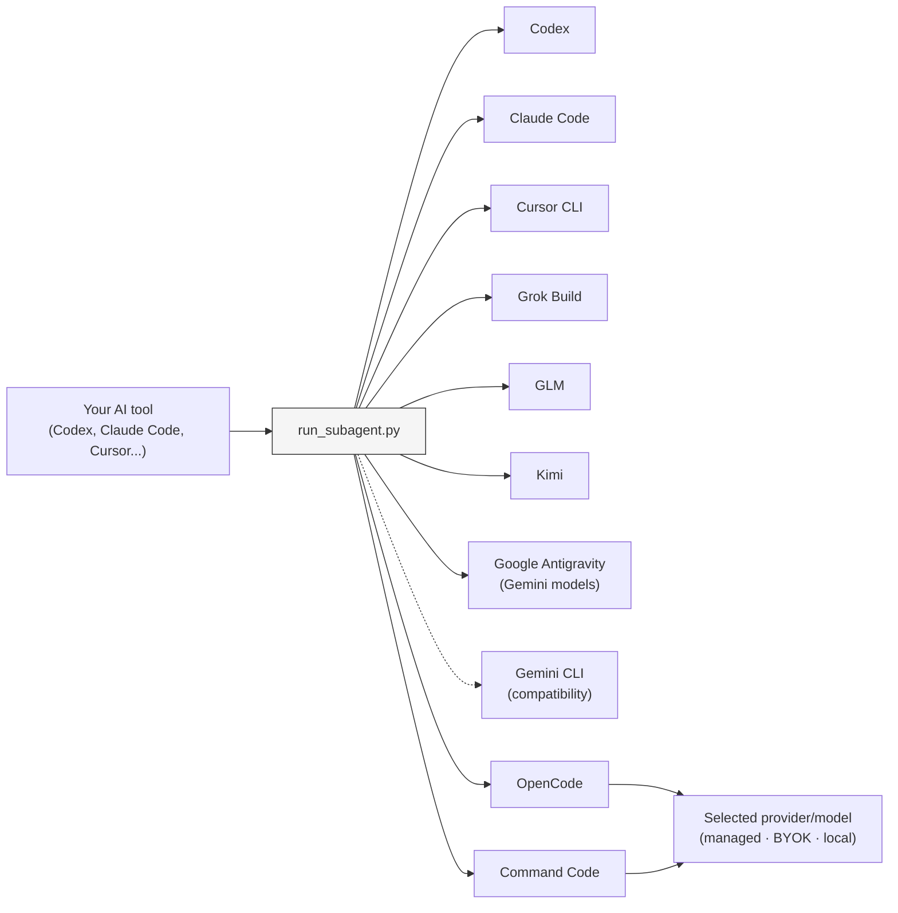

# Sub-Agents Skills

English | [简体中文](README.zh-CN.md) | [Русский](README.ru.md) | [Deutsch](README.de.md) | [Español](README.es.md)

[](https://developers.openai.com/codex/cli)
[](https://claude.ai/code)
[](https://www.kimi.com/code/en)
[](https://agentskills.io)
[](https://opensource.org/licenses/MIT)

Run task-specific agents on different AI coding backends from a single parent tool.

Write an agent once in Markdown, then choose the backend that runs it. Send implementation, review, investigation, and verification work to different coding tools without duplicating the agent definition.

The skill itself follows the [Agent Skills](https://agentskills.io) standard; the agents it runs are Markdown files under `.agents/`.


## Quick Start

**Requirements:** Python 3.9+ and at least one [supported backend](#supported-backends) installed.

### 1. Install the Skill

**Codex (plugin):**

```sh
codex plugin marketplace add shinpr/sub-agents-skills
```

Then open the plugin picker, install `Runner`, and restart Codex:

```text
/plugins
```

After restart, invoke the skill as `$runner:sub-agents`.

**Claude Code (plugin):**

```text
/plugin marketplace add shinpr/sub-agents-skills
/plugin install runner@sub-agents-skills
/reload-plugins
```

**Grok Build (plugin):**

```sh
grok plugin marketplace add shinpr/sub-agents-skills
grok plugin install runner --trust
```

**Google Antigravity (plugin):**

```sh
agy plugin install https://github.com/shinpr/sub-agents-skills/tree/main/plugins/runner
```

**Other clients (Cursor CLI, VS Code, etc.):**

Use the install script to copy the skill into the client's skill path:

```bash
# Cursor
curl -fsSL https://raw.githubusercontent.com/shinpr/sub-agents-skills/main/install.sh | bash -s -- --target ~/.cursor/skills

# VS Code / Copilot (project-scoped)
curl -fsSL https://raw.githubusercontent.com/shinpr/sub-agents-skills/main/install.sh | bash -s -- --target .github/skills

# Gemini CLI
curl -fsSL https://raw.githubusercontent.com/shinpr/sub-agents-skills/main/install.sh | bash -s -- --target ~/.gemini/skills
```

Or clone manually:

```bash
git clone https://github.com/shinpr/sub-agents-skills.git
cd sub-agents-skills
./install.sh --target <client-skill-path>
```

### 2. Create Your First Agent

Create a `.agents/` folder in your project and add `code-reviewer.md`:

```markdown
---
run-agent: codex
permission: read-only
---

# Code Reviewer

Review code for quality and maintainability issues.

## Task
- Find bugs and potential issues
- Suggest improvements
- Check code style consistency

## Done When
- All target files reviewed
- Issues listed with explanations
```

The `run-agent` frontmatter specifies which backend executes this agent. See [Writing Agents](#writing-agents) for more on agent design.

### 3. Run It

Ask your parent AI tool:

```text
Use the code-reviewer agent to review the authentication changes.
```

The parent tool invokes the agent with the selected backend and returns its result.

## Why Use It?

Most AI coding tools provide sub-agents tied to their own models. Claude Code delegates to Claude, and Codex delegates to GPT. Their built-in delegation does not provide a portable way to route a task to another provider's model.

Sub-Agents Skills separates an agent's role from its execution backend. The Markdown file defines what the agent does, while `run-agent` selects where it runs. Changing the backend does not require rewriting the role, task, or output instructions.

Because the runner is packaged as an Agent Skill, the same `.agents/` definitions can be used from different supported parent tools.

## Usage Examples

To run an agent, describe the task in your prompt:

```text
Use the code-reviewer agent to check my UserService class.
```

```text
Use the test-writer agent to create unit tests for the auth module.
```

```text
Use the doc-writer agent to add JSDoc comments to all public methods.
```

### Mixing Backends in One Project

Agents using different backends can live side by side:

```text
.agents/
├── test-writer.md         # run-agent: codex
├── code-reviewer.md       # run-agent: claude
├── kimi-implementer.md    # run-agent: kimi
└── alternate-reviewer.md  # run-agent: grok
```

```text
Use the code-reviewer and alternate-reviewer agents in parallel, then send the agreed changes to kimi-implementer.
```

Name both the agent and the task in the request; an agent name alone does not provide a task.

## Supported Backends

Set `run-agent` in each agent definition. The value selects a backend; some backends share an underlying executable.

| `run-agent` | Backend | Executed CLI |
|-------------|---------|--------------|
| `codex` | Codex | `codex` |
| `claude` | Claude Code | `claude` |
| `cursor-agent` | Cursor CLI | `cursor-agent` |
| `glm` | GLM (Z.ai) | `claude` with the Z.ai endpoint |
| `kimi` | Kimi | `claude` with the Kimi endpoint |
| `grok` | Grok Build | `grok` |
| `antigravity` | Google Antigravity | `agy` |
| `gemini` | Gemini CLI (compatibility) | `gemini` |
| `opencode` | OpenCode | `opencode` |
| `command-code` | Command Code | `command-code` |

Install only the CLIs you plan to use. For Google models, prefer Antigravity CLI 1.1.12 or later; existing Gemini CLI configurations remain supported.

## Writing Agents

Agent definitions are `.md` or `.txt` files under `.agents/`. For normal use, include `run-agent` in the YAML frontmatter and keep the task instructions in the body.

```markdown
---
run-agent: claude
model: opus
effort: high
permission: safe-edit
---

# Agent Name

One-sentence purpose.

## Task
- Action 1
- Action 2

## Done When
- Criterion 1
- Criterion 2
```

<details>
<summary>Frontmatter reference</summary>

### Frontmatter Options

| Field | Values | Description |
|-------|--------|-------------|
| `run-agent` | `codex`, `claude`, `cursor-agent`, `glm`, `kimi`, `grok`, `antigravity`, `gemini`, `opencode`, `command-code` | Which backend executes this agent |
| `model` | Backend-specific model name (optional) | Model passed to the selected CLI; omit to use its configured default |
| `effort` | Backend/model-specific value (optional) | Reasoning-effort override; omit to use the backend/model default |
| `permission` | `read-only`, `safe-edit` (default), `yolo` | Approval/sandbox level the sub-agent runs with |

`run-agent` is required unless `--cli` explicitly overrides it for one run.

`effort` is forwarded unchanged to the selected backend. Accepted values depend
on the backend and model, so check the provider documentation before setting it.
Invalid combinations fail at runtime. Cursor and Gemini do not support this
field.

**Permission levels:**

- `read-only`: investigation/review only, no edits or shell writes (codex `-s read-only` / claude `--permission-mode plan` / cursor `--mode plan --sandbox enabled` / grok `--sandbox read-only` / antigravity `--mode plan --sandbox` / gemini `--approval-mode plan` / OpenCode permission deny rules / Command Code plan mode)
- `safe-edit`: default non-interactive edit mode (codex `-s workspace-write` + `approval_policy=never` / claude `--permission-mode acceptEdits` / cursor `--trust --sandbox enabled` / grok `--sandbox workspace` / antigravity `--mode accept-edits --sandbox` / gemini `--approval-mode auto_edit` / OpenCode and Command Code runner policies)
- `yolo`: bypass all approvals and sandboxing; use it only for tasks and environments you trust.

Sub-agents have no stdin, so the runner uses non-interactive backend modes. The
isolation guarantees depend on the selected CLI; permission flags are not
equivalent across backends. For Cursor, the sandbox confines supported shell
commands, while `--mode plan` supplies the read-only constraint.

</details>

<details>
<summary>Agent authoring guidelines</summary>

### Keep Each Agent Focused

Give each agent one responsibility. Separate review, implementation, and test
generation when they need different instructions or permissions.

### Keep Agents Self-Contained

Agents run in isolation with fresh context. Avoid:

- References to other agents ("then use X agent...")
- Assumptions about prior context ("continuing from before...")
- Tasks outside the agent's stated responsibility

### Optional Agent Sections

Add these sections when the agent needs them:

- **Scope boundaries**: Explicitly state what's *out of scope*
- **Prohibited actions**: List common mistakes the agent should avoid
- **Output format**: Define structured output when needed

</details>

<details>
<summary>Complete agent example</summary>

Each `.md` or `.txt` file in your `.agents/` folder becomes an agent. The filename becomes the agent name (e.g., `bug-investigator.md` → "bug-investigator").

**`bug-investigator.md`**
```markdown
---
run-agent: codex
permission: read-only
---

# Bug Investigator

Investigate bug reports and identify root causes.

## Task
- Collect evidence from error logs, code, and git history
- Generate multiple hypotheses for the cause
- Trace each hypothesis to its root cause
- Report findings with supporting evidence

## Out of Scope
- Fixing the bug (investigation only)
- Making assumptions without evidence

## Done When
- At least 2 hypotheses documented with evidence
- Most likely cause identified with confidence level
- Affected code locations listed
```

For more advanced patterns (completion checklists, prohibited actions, structured output), see [claude-code-workflows/agents](https://github.com/shinpr/claude-code-workflows/tree/main/agents).

</details>

## Configuration Reference

<details>
<summary>Agent location and backend selection</summary>

### Agent Definition Location

| Priority | Source | Path |
|----------|--------|------|
| 1 | `--agents-dir` argument | Explicit path |
| 2 | Environment variable | `$SUB_AGENTS_DIR` |
| 3 | Default | `{cwd}/.agents/` |

To customize: `export SUB_AGENTS_DIR=/custom/path`

### CLI Selection Priority

1. `--cli` argument (explicit one-run override)
2. Agent definition `run-agent` frontmatter
3. Error if neither is specified

`--cli` always overrides the agent definition's `run-agent`; omit it for normal runs.

</details>

<details>
<summary>Direct runner CLI parameters</summary>

### Script Parameters

| Parameter | Required | Description |
|-----------|----------|-------------|
| `--list` | - | List available agents (no other params needed) |
| `--agent` | Yes* | Agent definition name from --list |
| `--prompt` | Yes* | Task description to delegate |
| `--cwd` | Yes* | Working directory (absolute path) |
| `--timeout` | No | Timeout ms (default: 600000) |
| `--cli` | No | Force CLI: `codex`, `claude`, `cursor-agent`, `glm`, `kimi`, `grok`, `antigravity`, `gemini`, `opencode`, `command-code` |

*Required when not using --list

</details>

## Backend Setup

Most backends use their CLI's existing authentication. The following backends
need additional routing or provider configuration.

<a id="glm-zai"></a>
<details>
<summary>GLM (Z.ai)</summary>

The `glm` backend runs the Claude Code binary against GLM's
Anthropic-compatible endpoint. Install Claude Code, then set your Z.ai token:

```bash
export GLM_API_KEY=<your-z.ai-token>
```

The runner sends the key through the child environment and points Claude Code
at `https://api.z.ai/api/anthropic`.

</details>

<a id="kimi"></a>
<details>
<summary>Kimi</summary>

The `kimi` backend runs the Claude Code binary against Kimi's coding endpoint.
Install Claude Code, then set your Kimi API key:

```bash
export KIMI_API_KEY=<your-kimi-api-key>
```

The runner sends the key through the child environment and points Claude Code
at `https://api.kimi.com/coding/`.

Provider-specific keys take priority, so multiple backends can remain
configured at the same time:

```bash
export GLM_API_KEY=<your-z.ai-token>
export KIMI_API_KEY=<your-kimi-api-key>
export CURSOR_API_KEY=<your-cursor-token> # optional when cursor-agent is logged in
```

</details>

<a id="opencode"></a>
<details>
<summary>OpenCode</summary>

The `opencode` backend uses the model selected in the agent definition. If
`model` is omitted, it uses OpenCode's configured default. Through OpenCode, an
agent can run on supported providers, OpenAI-compatible APIs, gateways, or local
models.

Configure OpenCode in `~/.config/opencode/opencode.json` or the project's
`opencode.json`, then use provider/model syntax when selecting a model:

```markdown
---
run-agent: opencode
model: provider/model-id
effort: provider-variant
permission: safe-edit
---
```

The runner passes `model` through `--model` and `effort` through OpenCode's
`--variant` option.

</details>

<a id="command-code"></a>
<details>
<summary>Command Code</summary>

Install Command Code and configure a model. Use `command-code login` for
Command Code-hosted models, and `command-code --list-models` to find model IDs.
Set `run-agent: command-code`; `model` and `effort` are optional.

</details>

## Security

Agent definitions are system prompts that control what the sub-agent does. A malicious agent definition could instruct the sub-agent to read sensitive files, execute harmful commands, or exfiltrate data.

Only use agent definitions you've written yourself or from sources you trust. Review any third-party agent definitions before use.

## How It Works

The parent tool reads the installed `SKILL.md` to learn how to invoke the runner.
The runner then loads the selected `.agents/*.md` definition, calls its configured
backend, and returns that invocation's result to the parent.


```mermaid
graph LR
    A["Your AI tool<br/>(Codex, Claude Code, Cursor...)"] --> B["run_subagent.py"]
    B --> C["Codex"]
    B --> D["Claude Code"]
    B --> E["Cursor CLI"]
    B --> H["Grok Build"]
    B --> G["GLM"]
    B --> K["Kimi"]
    B --> F["Google Antigravity<br/>(Gemini models)"]
    B -.-> GM["Gemini CLI<br/>(compatibility)"]
    B --> I["OpenCode"]
    B --> CC["Command Code"]
    I --> J["Selected provider/model<br/>(managed · BYOK · local)"]
    CC --> J
    style B fill:#f5f5f5,stroke:#333
```

```text
skills/sub-agents/
├── SKILL.md              # Instructions for the parent tool
├── scripts/
│   └── run_subagent.py   # Calls external CLIs
└── references/
    └── codex.md          # Host-specific setup notes
```

### Independent Contexts

Each sub-agent invocation starts a fresh conversation. Sub-agents do not inherit
one another's chat history. They do, however, use the same selected working
directory and can see the files it contains.

The parent receives the runner's final result, not the sub-agent's complete
conversation history. Each invocation starts a separate CLI process and has its
own startup cost.

## Troubleshooting

### Timeout errors or authentication failures

**Codex / Claude Code:**
Make sure the CLI is installed and accessible in your `PATH`.

**Cursor CLI:**
Run `cursor-agent login` to authenticate, or set `CURSOR_API_KEY`. Sessions can expire, so run the login command again if you see auth errors.

**GLM:**
Set `GLM_API_KEY` to your Z.ai token (see [GLM (Z.ai)](#glm-zai)).

**Kimi:**
Install Claude Code and set `KIMI_API_KEY` to your Kimi API key (see [Kimi](#kimi)).

**Google:**
Run `agy` once to authenticate before using the `antigravity` backend.
If you use the Gemini CLI backend instead, set `GEMINI_API_KEY` in the environment.

**OpenCode:**
Install OpenCode and configure a provider and default model. Run `opencode models`
and a direct `opencode run --format json` smoke test before using the backend.

**Command Code:**
Install Command Code and configure a model. Run `command-code status` to check
authentication before using the backend.

### Agent not found

Check that:
- Your agent file is in the `.agents/` directory (or path specified by `SUB_AGENTS_DIR`)
- The file has `.md` or `.txt` extension
- The filename uses hyphens or underscores (no spaces)

### CLI not found (exit code 127)

Install the required CLI:
- Codex: `npm install -g @openai/codex`
- Claude Code: `curl -fsSL https://claude.ai/install.sh | bash`
- Cursor CLI: `curl https://cursor.com/install -fsS | bash`
- Grok Build: `curl -fsSL https://x.ai/cli/install.sh | bash`
- Google Antigravity: `curl -fsSL https://antigravity.google/cli/install.sh | bash`
- OpenCode: `brew install anomalyco/tap/opencode`
- Command Code: `npm install -g command-code`

If you use Gemini CLI, install it with `npm install -g @google/gemini-cli`.

### Other execution errors

1. Verify the agent definition has valid `run-agent` frontmatter
2. Ensure your chosen CLI tool is installed and accessible
3. Check that `--cwd` is an absolute path to an existing directory

## License

MIT
