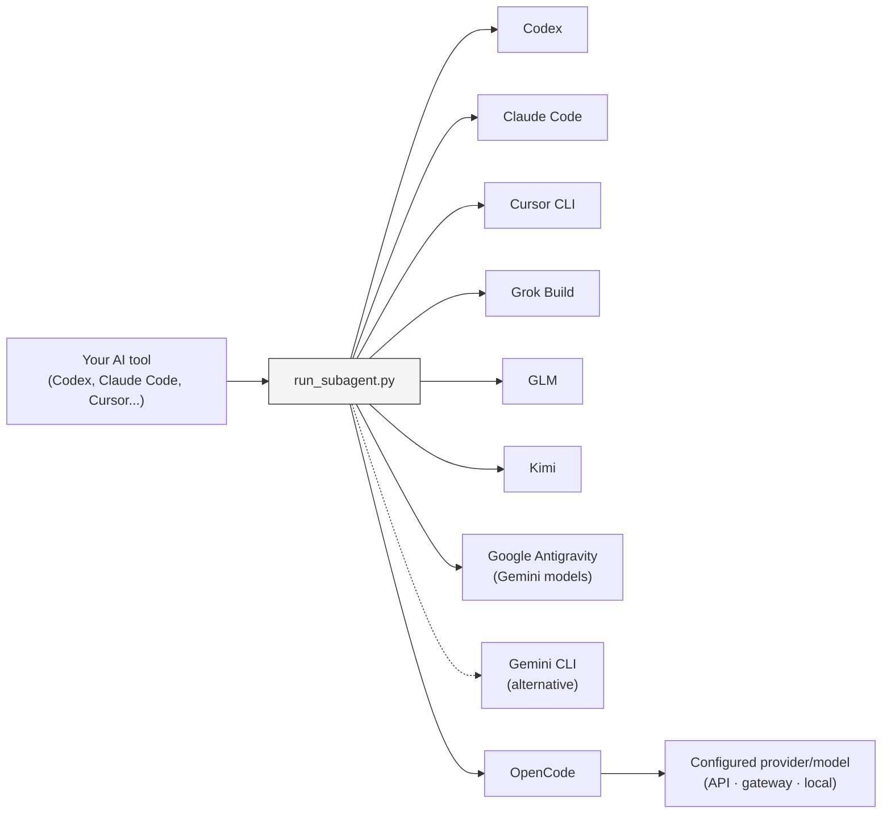

# Sub-Agents Skills

[](https://developers.openai.com/codex/cli)
[](https://claude.ai/code)
[](https://www.kimi.com/code/en)
[](https://agentskills.io)
[](https://opensource.org/licenses/MIT)

Run task-specific agents on different AI coding backends from one parent tool.

Use Codex, Claude Code, Cursor CLI, GLM, Kimi, Grok Build, Google Antigravity, and OpenCode as sub-agents in one workflow. Agent definitions are Markdown files, and each agent can select its execution backend. Gemini CLI remains available if you already use it.


```mermaid
graph LR
    A["Your AI tool<br/>(Codex, Claude Code, Cursor...)"] --> B["run_subagent.py"]
    B --> C["Codex"]
    B --> D["Claude Code"]
    B --> E["Cursor CLI"]
    B --> H["Grok Build"]
    B --> G["GLM"]
    B --> K["Kimi"]
    B --> F["Google Antigravity<br/>(Gemini models)"]
    B -.-> GM["Gemini CLI<br/>(alternative)"]
    B --> I["OpenCode"]
    I --> J["Configured provider/model<br/>(API · gateway · local)"]
    style B fill:#f5f5f5,stroke:#333
```

## Why?

Most AI coding tools provide sub-agents tied to their own models. Claude Code delegates to Claude, and Codex delegates to GPT. Their built-in delegation does not provide a portable way to route a task to another provider's model.

This skill lets each agent select a supported backend:

- **Backend selection per task:** Choose Codex for a quick edit, Claude Code for a deeper pass, or another supported backend for a separate implementation pass.
- **Portable definitions:** Plain Markdown agent files work with Codex, Claude Code, Cursor CLI, GLM, Kimi, Grok Build, Google Antigravity, VS Code, and [30+ other tools](https://agentskills.io) that support the Agent Skills format.
- **Direct provider billing:** Choose which model handles each task and pay the provider at its API rates.
- **Shared configuration:** Use the same agent definitions across a team with different IDEs or preferred LLMs.

## Supported Backends

Each agent definition specifies which CLI runs it via the `run-agent` frontmatter. You can mix backends freely within a project.

| Backend | CLI Command | Install |
|---------|-------------|---------|
| **Codex** (OpenAI) | `codex` | `npm install -g @openai/codex` |
| **Claude Code** (Anthropic) | `claude` | `curl -fsSL https://claude.ai/install.sh \| bash` |
| **Cursor** | `cursor-agent` | `curl https://cursor.com/install -fsS \| bash` |
| **GLM** (Z.ai) | `claude` (GLM endpoint) | Uses the Claude Code binary (see below) |
| **Kimi** | `claude` (Kimi endpoint) | Uses the Claude Code binary (see below) |
| **Grok Build** (SpaceX AI) | `grok` | `curl -fsSL https://x.ai/cli/install.sh \| bash` |
| **Antigravity** (Google) | `agy` | `curl -fsSL https://antigravity.google/cli/install.sh \| bash` |
| **OpenCode** | `opencode` | `brew install anomalyco/tap/opencode` |

You only need to install the backends you plan to use. For Google models, use Antigravity CLI 1.1.12 or later. Existing Gemini CLI installations continue to work with `run-agent: gemini`.

### GLM (Z.ai)

The `glm` backend runs the **Claude Code binary** against GLM's Anthropic-compatible endpoint, so it reuses Claude Code's streaming output and needs no separate CLI. Install `claude` as shown above. Unlike the `claude` backend, which appends the agent definition to Claude Code's default system prompt, the `glm` backend replaces the system prompt entirely, so the model runs on its own characteristics.

Set your Z.ai token in `GLM_API_KEY` before running a `glm` agent:

```bash
export GLM_API_KEY=<your-z.ai-token>
```

The skill forwards it to the Claude binary as the Z.ai credential (via env, never argv) and points the binary at `https://api.z.ai/api/anthropic`. Requests are billed by Z.ai, not Anthropic. Existing `CLI_API_KEY` configurations remain supported as a fallback.

### Kimi

The `kimi` backend runs the **Claude Code binary** against Kimi's coding endpoint, so it needs no separate CLI and reuses the same streaming output, model, effort, and permission controls as Claude Code. Like GLM, it replaces Claude Code's default system prompt with the selected agent definition.

Install `claude` as shown above, create a Kimi API key, and set:

```bash
export KIMI_API_KEY=<your-kimi-api-key>
```

The skill sends the key through the child environment, never argv, and points Claude Code at `https://api.kimi.com/coding/`. Existing `CLI_API_KEY` configurations are accepted as a fallback.

Provider-specific keys take priority over `CLI_API_KEY`, so GLM, Kimi, and Cursor credentials can stay configured together while different agents select the backend they need:

```bash
export GLM_API_KEY=<your-z.ai-token>
export KIMI_API_KEY=<your-kimi-api-key>
export CURSOR_API_KEY=<your-cursor-token> # optional when cursor-agent is logged in
```

### OpenCode

The `opencode` backend runs a model selected in the agent definition, or the
user's configured default when `model` is omitted. This provides one generic
route to OpenCode-supported providers, OpenAI-compatible APIs, gateways, and
local models without adding a backend for every model service.

Configure the provider, credentials, and default model in
`~/.config/opencode/opencode.json` or the project's `opencode.json`, then use:

```markdown
---
run-agent: opencode
model: provider/model-id
effort: provider-variant
permission: safe-edit
---
```

OpenCode model values use `provider/model` syntax. The runner passes an explicit
value through `--model`; without one, OpenCode resolves its configured default.
When `effort` is set, the runner passes it through as OpenCode's model-specific
`--variant` value.

## Quick Start

**Requirements:** Python 3.9+ and at least one [supported backend](#supported-backends) installed.

### 1. Install the Skill

**Codex (plugin):**

```sh
codex plugin marketplace add shinpr/sub-agents-skills
```

Then open the plugin picker, install `Runner`, and restart Codex:

```text
/plugins
```

After restart, invoke the skill as `$runner:sub-agents`.

**Claude Code (plugin):**

```text
/plugin marketplace add shinpr/sub-agents-skills
/plugin install runner@sub-agents-skills
/reload-plugins
```

**Grok Build (plugin):**

```sh
grok plugin marketplace add shinpr/sub-agents-skills
grok plugin install runner --trust
```

**Google Antigravity (plugin):**

```sh
agy plugin install https://github.com/shinpr/sub-agents-skills/tree/main/plugins/runner
```

**Other clients (Cursor CLI, VS Code, etc.):**

Use the install script to copy the skill into the client's skill path:

```bash
# Cursor
curl -fsSL https://raw.githubusercontent.com/shinpr/sub-agents-skills/main/install.sh | bash -s -- --target ~/.cursor/skills

# VS Code / Copilot (project-scoped)
curl -fsSL https://raw.githubusercontent.com/shinpr/sub-agents-skills/main/install.sh | bash -s -- --target .github/skills

# Gemini CLI
curl -fsSL https://raw.githubusercontent.com/shinpr/sub-agents-skills/main/install.sh | bash -s -- --target ~/.gemini/skills
```

Or clone manually:

```bash
git clone https://github.com/shinpr/sub-agents-skills.git
cd sub-agents-skills
./install.sh --target <client-skill-path>
```

### 2. Create Your First Agent

Create a `.agents/` folder in your project and add `code-reviewer.md`:

```markdown
---
run-agent: codex
permission: read-only
---

# Code Reviewer

Review code for quality and maintainability issues.

## Task
- Find bugs and potential issues
- Suggest improvements
- Check code style consistency

## Done When
- All target files reviewed
- Issues listed with explanations
```

The `run-agent` frontmatter specifies which CLI executes this agent. See [Writing Effective Agents](#writing-effective-agents) for more on agent design.

### 3. Fix "Permission Denied" Errors When Running Shell Commands

Sub-agents may fail to execute shell commands with permission errors. This happens because sub-agents can't respond to interactive permission prompts.

**Recommended approach:**

1. Run your CLI tool directly with the task you want sub-agents to handle:
   ```bash
   codex           # For Codex users
   claude          # For Claude Code users
   cursor-agent    # For Cursor CLI users
   grok            # For Grok Build users
   agy             # For Google models
   opencode        # For OpenCode users
   ```

   For an agent configured with `run-agent: gemini`, run `gemini` instead.

2. When prompted to allow commands (e.g., "Add Shell(cd), Shell(make) to allowlist?"), approve them

3. Approving updates your configuration file, so those commands will work when invoked via sub-agents

## Usage Examples

To run an agent, describe the task in your prompt:

```
"Use the code-reviewer agent to check my UserService class"
```

```
"Use the test-writer agent to create unit tests for the auth module"
```

```
"Use the doc-writer agent to add JSDoc comments to all public methods"
```

The host tool invokes the agent and returns results.

**Mixing backends in one project:**

You can have agents that use different LLMs side by side:

```
.agents/
├── test-writer.md         # run-agent: codex
├── code-reviewer.md       # run-agent: claude
├── kimi-implementer.md    # run-agent: kimi
└── alternate-reviewer.md  # run-agent: grok
```

```
"Use the code-reviewer and alternate-reviewer agents in parallel, then send the agreed changes to kimi-implementer"
```

**Tip:** Include *what you want done* in the request, not only the agent name. Specific requests produce more useful results.

## Writing Effective Agents

### The Single Responsibility Principle

Each agent should do **one thing well**. Avoid "swiss army knife" agents.

| Good | Bad |
|------|-----|
| Reviews code for security issues | Reviews code, writes tests, and refactors |
| Writes unit tests for a module | Writes tests and fixes bugs it finds |

### Essential Structure

```markdown
---
run-agent: codex
model: gpt-5.4-mini
permission: safe-edit
---

# Agent Name

One-sentence purpose.

## Task
- Action 1
- Action 2

## Done When
- Criterion 1
- Criterion 2
```

### Frontmatter Options

| Field | Values | Description |
|-------|--------|-------------|
| `run-agent` | `codex`, `claude`, `cursor-agent`, `glm`, `kimi`, `grok`, `antigravity`, `gemini`, `opencode` | Which CLI executes this agent |
| `model` | Backend-specific model name (optional) | Model passed to the selected CLI; omit to use its configured default |
| `effort` | Backend/model-specific value (optional) | Reasoning-effort override; omit to use the backend/model default |
| `permission` | `read-only`, `safe-edit` (default), `yolo` | Approval/sandbox level the sub-agent runs with |

`run-agent` is required unless `--cli` explicitly overrides it for one run.

`effort` is an advanced option whose accepted values depend on both the backend
and model. The runner treats the value as opaque and forwards it unchanged to
Codex as `model_reasoning_effort`, Claude/GLM/Kimi/Antigravity as `--effort`, Grok as
`--reasoning-effort`, and OpenCode as `--variant`. Set it when the selected
model's accepted values are confirmed in the CLI/provider documentation;
otherwise omit the field and use the backend/model default. Invalid combinations
fail at runtime. For the current GLM-5.2 target, use `high` or `max`. Cursor and
Gemini are unsupported for this field; selecting either backend with `effort`
set returns an error.

**Permission levels:**

- `read-only`: investigation/review only, no edits or shell writes (codex `-s read-only` / claude `--permission-mode plan` / cursor `--mode plan` / grok `--sandbox read-only` / antigravity `--mode plan --sandbox` / gemini `--approval-mode plan` / OpenCode permission deny rules)
- `safe-edit`: auto-approve edits inside the workspace, suppress prompts (default; codex `-s workspace-write` + `approval_policy=never` / claude `--permission-mode acceptEdits` / cursor `--trust` / grok `--sandbox workspace` / antigravity `--mode accept-edits --sandbox` / gemini `--approval-mode auto_edit` / OpenCode `external_directory: deny`)
- `yolo`: bypass all approvals and sandboxing. Use with care.

Sub-agents have no stdin, so any approval prompt would deadlock the run. The default `safe-edit` keeps normal tool writes confined to the workspace while suppressing prompts. OpenCode permission controls are not an OS-level sandbox and cannot confine every side effect of arbitrary programs launched through bash.

### Keep Agents Self-Contained

Agents run in isolation with fresh context. Avoid:

- References to other agents ("then use X agent...")
- Assumptions about prior context ("continuing from before...")
- Scope creep beyond the stated purpose

### Optional Agent Sections

For complex agents, consider adding:

- **Scope boundaries**: Explicitly state what's *out of scope*
- **Prohibited actions**: List common mistakes the agent should avoid
- **Output format**: Define structured output when needed

## Agent Examples

Each `.md` or `.txt` file in your `.agents/` folder becomes an agent. The filename becomes the agent name (e.g., `bug-investigator.md` → "bug-investigator").

**`bug-investigator.md`**
```markdown
---
run-agent: codex
permission: read-only
---

# Bug Investigator

Investigate bug reports and identify root causes.

## Task
- Collect evidence from error logs, code, and git history
- Generate multiple hypotheses for the cause
- Trace each hypothesis to its root cause
- Report findings with supporting evidence

## Out of Scope
- Fixing the bug (investigation only)
- Making assumptions without evidence

## Done When
- At least 2 hypotheses documented with evidence
- Most likely cause identified with confidence level
- Affected code locations listed
```

For more advanced patterns (completion checklists, prohibited actions, structured output), see [claude-code-workflows/agents](https://github.com/shinpr/claude-code-workflows/tree/main/agents).

## Configuration Reference

### Agent Definition Location

| Priority | Source | Path |
|----------|--------|------|
| 1 | `--agents-dir` argument | Explicit path |
| 2 | Environment variable | `$SUB_AGENTS_DIR` |
| 3 | Default | `{cwd}/.agents/` |

To customize: `export SUB_AGENTS_DIR=/custom/path`

### CLI Selection Priority

1. `--cli` argument (explicit one-run override)
2. Agent definition `run-agent` frontmatter
3. Error if neither is specified

`--cli` always overrides the agent definition's `run-agent`; omit it for normal runs.

### Script Parameters

| Parameter | Required | Description |
|-----------|----------|-------------|
| `--list` | - | List available agents (no other params needed) |
| `--agent` | Yes* | Agent definition name from --list |
| `--prompt` | Yes* | Task description to delegate |
| `--cwd` | Yes* | Working directory (absolute path) |
| `--timeout` | No | Timeout ms (default: 600000) |
| `--cli` | No | Force CLI: `codex`, `claude`, `cursor-agent`, `glm`, `kimi`, `grok`, `antigravity`, `gemini`, `opencode` |

*Required when not using --list

### Security Note

Agent definitions are system prompts that control what the sub-agent does. A malicious agent definition could instruct the sub-agent to read sensitive files, execute harmful commands, or exfiltrate data.

Only use agent definitions you've written yourself or from sources you trust. Review any third-party agent definitions before use.

## Troubleshooting

### Timeout errors or authentication failures

**Codex / Claude Code:**
Make sure the CLI is installed and accessible in your `PATH`.

**Cursor CLI:**
Run `cursor-agent login` to authenticate, or set `CURSOR_API_KEY`. `CLI_API_KEY` remains available as a compatibility fallback. Sessions can expire, so run the login command again if you see auth errors.

**GLM:**
Set `GLM_API_KEY` to your Z.ai token. `CLI_API_KEY` remains available as a compatibility fallback (see [GLM (Z.ai)](#glm-zai)).

**Kimi:**
Install Claude Code and set `KIMI_API_KEY` to your Kimi API key. `CLI_API_KEY` remains available as a compatibility fallback (see [Kimi](#kimi)).

**Google:**
Run `agy` once to authenticate before using the `antigravity` backend.
If you use the Gemini CLI backend instead, set `GEMINI_API_KEY` in the environment.

**OpenCode:**
Install OpenCode and configure a provider and default model. Run `opencode models`
and a direct `opencode run --format json` smoke test before using the backend.

### Agent not found

Check that:
- Your agent file is in the `.agents/` directory (or path specified by `SUB_AGENTS_DIR`)
- The file has `.md` or `.txt` extension
- The filename uses hyphens or underscores (no spaces)

### CLI not found (exit code 127)

Install the required CLI:
- Codex: `npm install -g @openai/codex`
- Claude Code: `curl -fsSL https://claude.ai/install.sh | bash`
- Cursor CLI: `curl https://cursor.com/install -fsS | bash`
- Grok Build: `curl -fsSL https://x.ai/cli/install.sh | bash`
- Google Antigravity: `curl -fsSL https://antigravity.google/cli/install.sh | bash`
- OpenCode: `brew install anomalyco/tap/opencode`

If you use Gemini CLI, install it with `npm install -g @google/gemini-cli`.

### Other execution errors

1. Verify the agent definition has valid `run-agent` frontmatter
2. Ensure your chosen CLI tool is installed and accessible
3. Check that `--cwd` is an absolute path to an existing directory

## Design Philosophy

### Why Independent Contexts?

Every sub-agent starts fresh. No shared state, no context from previous runs.

Each call has some startup overhead, but previous runs do not add state to the next one. When you split a large task into sub-agents, each agent receives only the context for its assigned goal.

The main agent stays lightweight too. It coordinates work without accumulating all the sub-agent context in its own window.

### Agent Skills as an Open Standard

This skill uses the [Agent Skills](https://agentskills.io) format for packaging reusable AI agent capabilities as portable files. Codex, Claude Code, Cursor CLI, Grok Build, Google Antigravity, and [30+ other tools](https://agentskills.io) support the format, so the same skill can be used across these environments.

## How It Works

Your AI reads the skill definition (SKILL.md), which tells it how to invoke the Python script. The script reads the agent definition (your `.agents/*.md` file), calls the appropriate CLI, and returns the result.

```
skills/sub-agents/
├── SKILL.md              # Instructions for the AI
├── scripts/
│   └── run_subagent.py   # Calls external CLIs
└── references/
    └── codex.md          # Codex-specific setup docs
```

## License

MIT
