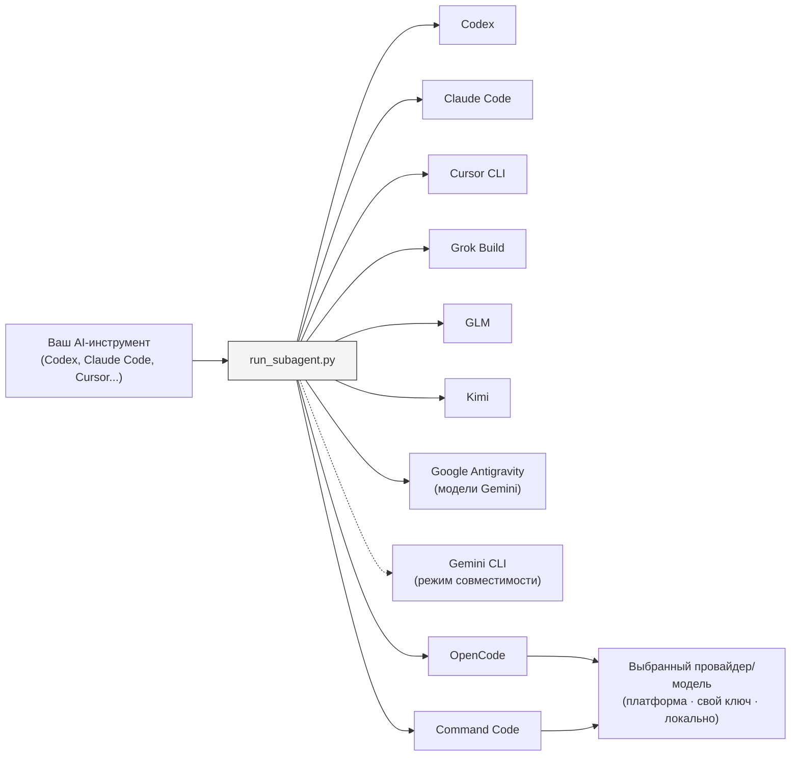

# Sub-Agents Skills

[English](README.md) | [简体中文](README.zh-CN.md) | Русский | [Deutsch](README.de.md) | [Español](README.es.md)

[](https://developers.openai.com/codex/cli)
[](https://claude.ai/code)
[](https://www.kimi.com/code/en)
[](https://agentskills.io)
[](https://opensource.org/licenses/MIT)

Запускайте специализированных агентов на разных бэкендах для AI-разработки с помощью одного родительского инструмента.

Опишите агента один раз в Markdown, а затем выбирайте бэкенд, который его запустит. Реализацию, ревью, исследование и проверку можно поручать разным инструментам, не дублируя определение агента.

Сам Skill соответствует стандарту [Agent Skills](https://agentskills.io), а запускаемые им агенты хранятся в виде Markdown-файлов в каталоге `.agents/`.


## Быстрый старт

**Требования:** Python 3.9 или новее и хотя бы один установленный [поддерживаемый бэкенд](#supported-backends).

### 1. Установите Skill

**Codex (плагин):**

```sh
codex plugin marketplace add shinpr/sub-agents-skills
```

Откройте список плагинов, установите `Runner` и перезапустите Codex:

```text
/plugins
```

После перезапуска вызывайте Skill как `$runner:sub-agents`.

**Claude Code (плагин):**

```text
/plugin marketplace add shinpr/sub-agents-skills
/plugin install runner@sub-agents-skills
/reload-plugins
```

**Grok Build (плагин):**

```sh
grok plugin marketplace add shinpr/sub-agents-skills
grok plugin install runner --trust
```

**Google Antigravity (плагин):**

```sh
agy plugin install https://github.com/shinpr/sub-agents-skills/tree/main/plugins/runner
```

**Другие клиенты (Cursor CLI, VS Code и т. д.):**

Скопируйте Skill в каталог навыков нужного клиента с помощью установочного скрипта:

```bash
# Cursor
curl -fsSL https://raw.githubusercontent.com/shinpr/sub-agents-skills/main/install.sh | bash -s -- --target ~/.cursor/skills

# VS Code / Copilot (только для текущего проекта)
curl -fsSL https://raw.githubusercontent.com/shinpr/sub-agents-skills/main/install.sh | bash -s -- --target .github/skills

# Gemini CLI
curl -fsSL https://raw.githubusercontent.com/shinpr/sub-agents-skills/main/install.sh | bash -s -- --target ~/.gemini/skills
```

Либо клонируйте репозиторий и установите Skill вручную:

```bash
git clone https://github.com/shinpr/sub-agents-skills.git
cd sub-agents-skills
./install.sh --target <client-skill-path>
```

### 2. Создайте первого агента

Создайте в проекте каталог `.agents/` и добавьте файл `code-reviewer.md`:

```markdown
---
run-agent: codex
permission: read-only
---

# Ревьюер кода

Проверь код на проблемы с качеством и сопровождаемостью.

## Задача
- Найти ошибки и потенциальные проблемы
- Предложить улучшения
- Проверить единообразие стиля кода

## Готово, когда
- Проверены все целевые файлы
- Все найденные проблемы перечислены и объяснены
```

Поле `run-agent` во frontmatter указывает, какой бэкенд запустит агента. Подробнее о структуре агента — в разделе [Как описывать агентов](#writing-agents).

### 3. Запустите агента

Дайте родительскому AI-инструменту следующую инструкцию:

```text
Используй агента code-reviewer, чтобы проверить изменения в аутентификации.
```

Родительский инструмент вызовет агента через выбранный бэкенд и вернёт его результат.

## Зачем это нужно?

Во многих AI-инструментах для разработки субагенты привязаны к моделям одного провайдера: Claude Code делегирует задачи Claude, а Codex — GPT. Встроенные механизмы делегирования не дают независимого от инструмента способа передавать задачи моделям других провайдеров.

Sub-Agents Skills отделяет роль агента от бэкенда, на котором тот выполняется. Markdown-файл описывает работу агента, а `run-agent` определяет, где её запустить. Чтобы сменить бэкенд, не нужно переписывать роль, задачу или формат результата.

Раннер упакован как Agent Skill, поэтому один и тот же набор определений из `.agents/` можно использовать в разных поддерживаемых родительских инструментах.

## Примеры использования

Чтобы запустить агента, укажите задачу в запросе:

```text
Используй агента code-reviewer, чтобы проверить мой класс UserService.
```

```text
Используй агента test-writer, чтобы написать модульные тесты для модуля auth.
```

```text
Используй агента doc-writer, чтобы добавить комментарии JSDoc ко всем публичным методам.
```

### Несколько бэкендов в одном проекте

Агенты с разными бэкендами могут находиться рядом:

```text
.agents/
├── test-writer.md         # run-agent: codex
├── code-reviewer.md       # run-agent: claude
├── kimi-implementer.md    # run-agent: kimi
└── alternate-reviewer.md  # run-agent: grok
```

```text
Параллельно запусти агентов code-reviewer и alternate-reviewer, а затем передай согласованные изменения агенту kimi-implementer.
```

В запросе указывайте и имя агента, и его задачу: одного имени недостаточно, чтобы понять, что нужно сделать.

<a id="supported-backends"></a>
## Поддерживаемые бэкенды

Укажите `run-agent` в определении каждого агента. Значение определяет бэкенд; некоторые бэкенды используют один и тот же исполняемый файл.

| `run-agent` | Бэкенд | Запускаемый CLI |
|-------------|--------|----------------|
| `codex` | Codex | `codex` |
| `claude` | Claude Code | `claude` |
| `cursor-agent` | Cursor CLI | `cursor-agent` |
| `glm` | GLM (Z.ai) | `claude` с эндпоинтом Z.ai |
| `kimi` | Kimi | `claude` с эндпоинтом Kimi |
| `grok` | Grok Build | `grok` |
| `antigravity` | Google Antigravity | `agy` |
| `gemini` | Gemini CLI (режим совместимости) | `gemini` |
| `opencode` | OpenCode | `opencode` |
| `command-code` | Command Code | `command-code` |

Устанавливайте только те CLI, которыми собираетесь пользоваться. Для моделей Google рекомендуется Antigravity CLI 1.1.12 или новее; существующие конфигурации Gemini CLI продолжат работать.

<a id="writing-agents"></a>
## Как описывать агентов

Определения агентов — это файлы `.md` или `.txt` в каталоге `.agents/`. В обычном случае укажите `run-agent` в YAML-frontmatter, а саму задачу опишите в теле файла.

```markdown
---
run-agent: claude
model: opus
effort: high
permission: safe-edit
---

# Имя агента

Одним предложением опишите его назначение.

## Задача
- Действие 1
- Действие 2

## Готово, когда
- Условие 1
- Условие 2
```

<details>
<summary>Поля frontmatter</summary>

### Доступные поля

| Поле | Значения | Описание |
|------|----------|----------|
| `run-agent` | `codex`, `claude`, `cursor-agent`, `glm`, `kimi`, `grok`, `antigravity`, `gemini`, `opencode`, `command-code` | Бэкенд, который запускает агента |
| `model` | Имя модели для выбранного бэкенда (необязательно) | Передаётся выбранному CLI; если поле опущено, используется настроенная по умолчанию модель |
| `effort` | Значение, поддерживаемое бэкендом и моделью (необязательно) | Переопределяет уровень рассуждений; если поле опущено, используется значение по умолчанию |
| `permission` | `read-only`, `safe-edit` (по умолчанию), `yolo` | Режим подтверждений и песочницы для субагента |

Поле `run-agent` обязательно, если бэкенд не переопределён для конкретного запуска параметром `--cli`.

Значение `effort` передаётся выбранному бэкенду без изменений. Допустимые значения зависят от бэкенда и модели — сверяйтесь с документацией провайдера. Недопустимое сочетание приведёт к ошибке при запуске. Cursor и Gemini не поддерживают это поле.

**Уровни доступа:**

- `read-only`: режим исследования и ревью, запрещающий прямое редактирование там, где это поддерживает бэкенд; поведение shell зависит от бэкенда, и этот режим не является границей безопасности (codex `-s read-only` / claude `--permission-mode plan` / cursor `--mode plan --sandbox enabled` / grok `--sandbox read-only` / antigravity `--mode plan --sandbox` / gemini `--approval-mode plan` / правила разрешений OpenCode / режим plan в Command Code)
- `safe-edit`: стандартный неинтерактивный режим редактирования (codex `-s workspace-write` + `approval_policy=never` / claude `--permission-mode acceptEdits` / cursor `--trust --sandbox enabled` / grok `--sandbox workspace` / antigravity `--mode accept-edits --sandbox` / gemini `--approval-mode auto_edit` / правила разрешений раннера для OpenCode и Command Code)
- `yolo`: отключает все подтверждения и песочницу; используйте только для задач и окружений, которым доверяете.

У субагентов нет стандартного ввода, поэтому раннер запускает бэкенды в неинтерактивном режиме. Режимы доступа в разных CLI не полностью эквивалентны, а гарантии изоляции зависят от конкретного инструмента. Например, песочница Cursor выполняет поддерживаемые команды оболочки в изолированной среде, а `--mode plan` задаёт режим только для чтения.

</details>

<details>
<summary>Рекомендации по описанию агентов</summary>

### Один агент — одна ответственность

Давайте каждому агенту одну ответственность. Если ревью, реализация и написание тестов требуют разных инструкций или уровней доступа, разделите их между разными агентами.

### Самодостаточные определения

Каждый агент запускается изолированно и получает новый контекст. Не следует:

- ссылаться на других агентов («затем используй агента X»);
- рассчитывать на контекст из предыдущего запуска («продолжи с того места, где мы остановились»);
- включать задачи, выходящие за пределы ответственности агента.

### Дополнительные разделы

При необходимости добавьте:

- **Границы задачи**: явно укажите, что не входит в работу;
- **Запрещённые действия**: перечислите типичные ошибки, которых следует избегать;
- **Формат результата**: задайте структуру результата, если она важна.

</details>

<details>
<summary>Полный пример агента</summary>

Каждый файл `.md` или `.txt` в каталоге `.agents/` становится агентом. Имя файла становится именем агента: например, `bug-investigator.md` — это агент `bug-investigator`.

**`bug-investigator.md`**
```markdown
---
run-agent: codex
permission: read-only
---

# Исследователь ошибок

Исследуй сообщения об ошибках и установи их первопричины.

## Задача
- Собрать доказательства из журналов ошибок, кода и истории Git
- Сформулировать несколько гипотез о причине
- Проверить каждую гипотезу и дойти до первопричины
- Описать выводы и приложить подтверждающие данные

## За рамками задачи
- Исправление ошибки — этот агент занимается только исследованием
- Предположения без доказательств

## Готово, когда
- Описаны как минимум две гипотезы с доказательствами
- Указана наиболее вероятная причина и степень уверенности
- Перечислены затронутые участки кода
```

Более сложные шаблоны — списки критериев готовности, запрещённые действия и структурированный формат результата — см. в репозитории [claude-code-workflows/agents](https://github.com/shinpr/claude-code-workflows/tree/main/agents).

</details>

## Справочник по конфигурации

<details>
<summary>Расположение агентов и выбор бэкенда</summary>

### Где искать определения агентов

| Приоритет | Источник | Путь |
|-----------|----------|------|
| 1 | Аргумент `--agents-dir` | Явно указанный путь |
| 2 | Переменная окружения | `$SUB_AGENTS_DIR` |
| 3 | Значение по умолчанию | `{cwd}/.agents/` |

Чтобы изменить путь: `export SUB_AGENTS_DIR=/custom/path`

### Приоритет выбора CLI

1. Аргумент `--cli` — явное переопределение для одного запуска
2. Поле `run-agent` во frontmatter определения агента
3. Ошибка, если не указано ни то ни другое

`--cli` всегда имеет приоритет над `run-agent` из определения агента. При обычном запуске не передавайте этот аргумент.

</details>

<details>
<summary>Параметры прямого запуска раннера</summary>

### Параметры скрипта

| Параметр | Обязателен | Описание |
|----------|------------|----------|
| `--list` | Нет | Вывести доступных агентов; другие параметры не нужны |
| `--agent` | Да* | Имя определения агента из вывода `--list` |
| `--prompt` | Да* | Описание делегируемой задачи |
| `--cwd` | Да* | Рабочий каталог, абсолютный путь |
| `--timeout` | Нет | Тайм-аут в миллисекундах, по умолчанию 600000 |
| `--cli` | Нет | Принудительно выбрать CLI: `codex`, `claude`, `cursor-agent`, `glm`, `kimi`, `grok`, `antigravity`, `gemini`, `opencode`, `command-code` |

\* Обязательно, если не используется `--list`.

</details>

## Настройка бэкендов

Большинство бэкендов используют существующую аутентификацию своего CLI. Следующим бэкендам нужны дополнительные параметры маршрутизации или провайдера.

<a id="glm-zai"></a>
<details>
<summary>GLM (Z.ai)</summary>

Бэкенд `glm` запускает Claude Code с Anthropic-совместимым эндпоинтом GLM. Установите Claude Code, затем задайте токен Z.ai:

```bash
export GLM_API_KEY=<your-z.ai-token>
```

Раннер передаёт ключ в окружение дочернего процесса и направляет Claude Code на `https://api.z.ai/api/anthropic`.

</details>

<a id="kimi"></a>
<details>
<summary>Kimi</summary>

Бэкенд `kimi` запускает Claude Code с эндпоинтом Kimi для программирования. Установите Claude Code, затем задайте API-ключ Kimi:

```bash
export KIMI_API_KEY=<your-kimi-api-key>
```

Раннер передаёт ключ в окружение дочернего процесса и направляет Claude Code на `https://api.kimi.com/coding/`.

Ключи конкретных провайдеров имеют приоритет, поэтому несколько бэкендов можно настроить одновременно:

```bash
export GLM_API_KEY=<your-z.ai-token>
export KIMI_API_KEY=<your-kimi-api-key>
export CURSOR_API_KEY=<your-cursor-token> # необязательно, если cursor-agent уже авторизован
```

</details>

<a id="opencode"></a>
<details>
<summary>OpenCode</summary>

Бэкенд `opencode` использует модель из определения агента. Если поле `model` опущено, используется модель OpenCode по умолчанию. Через OpenCode агент может работать с поддерживаемыми провайдерами, OpenAI-совместимыми API, шлюзами и локальными моделями.

Настройте OpenCode в `~/.config/opencode/opencode.json` или в проектном `opencode.json`. При выборе модели используйте формат «провайдер/модель»:

```markdown
---
run-agent: opencode
model: provider/model-id
effort: provider-variant
permission: safe-edit
---
```

Раннер передаёт `model` через параметр `--model`, а `effort` — через параметр OpenCode `--variant`.

</details>

<a id="command-code"></a>
<details>
<summary>Command Code</summary>

Установите Command Code и настройте модель. Выполните `command-code login`, чтобы использовать модели, размещённые в Command Code, а список идентификаторов моделей получите командой `command-code --list-models`. Укажите `run-agent: command-code`; поля `model` и `effort` необязательны.

</details>

## Безопасность

Определения агентов становятся системными промптами и напрямую управляют действиями субагента. Вредоносное определение может потребовать прочитать конфиденциальные файлы, выполнить опасные команды или отправить данные третьей стороне.

Используйте только определения, написанные вами или полученные из доверенных источников. Перед запуском стороннего агента обязательно прочитайте его определение.

## Как это работает

Родительский инструмент читает установленный `SKILL.md` и узнаёт из него, как вызвать раннер. Затем раннер загружает выбранное определение `.agents/*.md`, вызывает настроенный в нём бэкенд и возвращает родителю результат этого запуска.



```text
skills/sub-agents/
├── SKILL.md              # Инструкции для родительского инструмента
├── scripts/
│   └── run_subagent.py   # Вызывает внешние CLI
└── references/
    └── codex.md          # Настройка для конкретного хоста
```

### Независимые контексты

Каждый запуск субагента начинает новый диалог. Субагенты не наследуют историю друг друга, но работают в одном выбранном рабочем каталоге и видят находящиеся в нём файлы.

Родитель получает итоговый результат раннера, а не полную историю диалога субагента. Каждый запуск создаёт отдельный процесс CLI и требует времени на его запуск.

## Устранение неполадок

### Тайм-ауты и ошибки аутентификации

**Codex / Claude Code:**
Убедитесь, что CLI установлен и доступен через `PATH`.

**Cursor CLI:**
Выполните `cursor-agent login` или задайте `CURSOR_API_KEY`. Сеанс может истечь; если появилась ошибка аутентификации, войдите снова.

**GLM:**
Задайте `GLM_API_KEY` — см. [GLM (Z.ai)](#glm-zai).

**Kimi:**
Установите Claude Code и задайте `KIMI_API_KEY` — см. [Kimi](#kimi).

**Google:**
Перед использованием бэкенда `antigravity` один раз запустите `agy` для аутентификации. Для бэкенда Gemini CLI задайте в окружении `GEMINI_API_KEY`.

**OpenCode:**
Установите OpenCode и настройте провайдера и модель по умолчанию. Перед использованием выполните `opencode models`, а затем проверьте прямой запуск командой `opencode run --format json`.

**Command Code:**
Установите Command Code и настройте модель. Проверьте аутентификацию командой `command-code status`.

### Агент не найден

Проверьте следующее:

- файл агента находится в каталоге `.agents/` или в каталоге из `SUB_AGENTS_DIR`;
- файл имеет расширение `.md` или `.txt`;
- в имени файла используются дефисы или подчёркивания, но нет пробелов.

### CLI не найден (код выхода 127)

Установите нужный CLI:

- Codex: `npm install -g @openai/codex`
- Claude Code: `curl -fsSL https://claude.ai/install.sh | bash`
- Cursor CLI: `curl https://cursor.com/install -fsS | bash`
- Grok Build: `curl -fsSL https://x.ai/cli/install.sh | bash`
- Google Antigravity: `curl -fsSL https://antigravity.google/cli/install.sh | bash`
- OpenCode: `brew install anomalyco/tap/opencode`
- Command Code: `npm install -g command-code`

Для Gemini CLI используйте `npm install -g @google/gemini-cli`.

### Другие ошибки запуска

1. Проверьте, что во frontmatter определения агента указано допустимое значение `run-agent`.
2. Убедитесь, что выбранный CLI установлен и доступен.
3. Убедитесь, что `--cwd` содержит абсолютный путь к существующему каталогу.

## Лицензия

MIT
