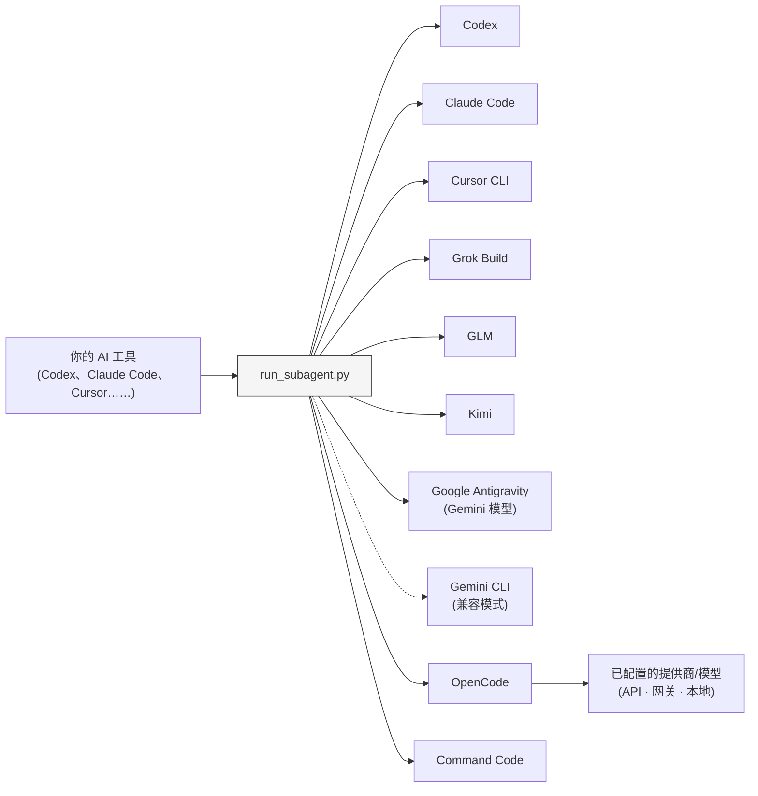

# Sub-Agents Skills

[English](README.md) | 简体中文

[](https://developers.openai.com/codex/cli)
[](https://claude.ai/code)
[](https://www.kimi.com/code/en)
[](https://agentskills.io)
[](https://opensource.org/licenses/MIT)

通过同一个父级工具，在不同的 AI 编程后端上运行针对特定任务的代理。

每个代理只需用 Markdown 定义一次，之后可以分别选择各自的执行后端。无论是实现功能、审查代码、调查问题还是验证结果，都能交给不同的编程后端，无需为此重写代理定义。

本 Skill 遵循 [Agent Skills](https://agentskills.io) 标准；由它调用的代理则以 Markdown 文件的形式存放在 `.agents/` 目录中。


## 快速开始

**环境要求：** Python 3.9 或更高版本，并且至少安装一个[支持的后端](#supported-backends)。

### 1. 安装 Skill

**Codex（插件）：**

```sh
codex plugin marketplace add shinpr/sub-agents-skills
```

然后打开插件选择器，安装 `Runner`，再重启 Codex：

```text
/plugins
```

重启后，通过 `$runner:sub-agents` 调用本 Skill。

**Claude Code（插件）：**

```text
/plugin marketplace add shinpr/sub-agents-skills
/plugin install runner@sub-agents-skills
/reload-plugins
```

**Grok Build（插件）：**

```sh
grok plugin marketplace add shinpr/sub-agents-skills
grok plugin install runner --trust
```

**Google Antigravity（插件）：**

```sh
agy plugin install https://github.com/shinpr/sub-agents-skills/tree/main/plugins/runner
```

**其他客户端（Cursor CLI、VS Code 等）：**

运行安装脚本，将本 Skill 复制到对应客户端的 Skill 目录：

```bash
# Cursor
curl -fsSL https://raw.githubusercontent.com/shinpr/sub-agents-skills/main/install.sh | bash -s -- --target ~/.cursor/skills

# VS Code / Copilot（仅当前项目）
curl -fsSL https://raw.githubusercontent.com/shinpr/sub-agents-skills/main/install.sh | bash -s -- --target .github/skills

# Gemini CLI
curl -fsSL https://raw.githubusercontent.com/shinpr/sub-agents-skills/main/install.sh | bash -s -- --target ~/.gemini/skills
```

也可以手动克隆并安装：

```bash
git clone https://github.com/shinpr/sub-agents-skills.git
cd sub-agents-skills
./install.sh --target <client-skill-path>
```

### 2. 创建第一个代理

在项目中创建 `.agents/` 目录，并添加 `code-reviewer.md`：

```markdown
---
run-agent: codex
permission: read-only
---

# 代码审查代理

审查代码质量和可维护性问题。

## 任务
- 查找 bug 和潜在问题
- 提出改进建议
- 检查代码风格是否一致

## 完成条件
- 已审查所有目标文件
- 已列出问题及其说明
```

frontmatter 中的 `run-agent` 用来指定执行该代理的后端。有关代理设计的更多说明，请参阅[编写代理定义](#writing-agents)。

### 3. 运行代理

向父级 AI 工具提出请求：

```text
使用 code-reviewer 代理审查身份验证相关的改动。
```

父级工具会调用所选后端上的代理，并将结果返回给你。

## 为什么使用它？

大多数 AI 编程工具提供的子代理只能使用自家的模型：Claude Code 将任务交给 Claude，Codex 则交给 GPT。但它们内置的委派机制无法以可移植的方式将任务交给其他提供商的模型。

Sub-Agents Skills 将代理的职责与执行后端分离。Markdown 文件定义代理要做什么，`run-agent` 则决定它在哪个后端运行。切换后端时，无需重写角色、任务或输出要求。

由于 runner 本身以 Agent Skill 的形式提供，同一套 `.agents/` 定义可以在多个受支持的父级工具中复用。

## 使用示例

调用代理时，请在提示词中说明具体任务：

```text
使用 code-reviewer 代理检查我的 UserService 类。
```

```text
使用 test-writer 代理为 auth 模块创建单元测试。
```

```text
使用 doc-writer 代理为所有公共方法添加 JSDoc 注释。
```

### 在同一个项目中混用多个后端

使用不同后端的代理可以并存：

```text
.agents/
├── test-writer.md         # run-agent: codex
├── code-reviewer.md       # run-agent: claude
├── kimi-implementer.md    # run-agent: kimi
└── alternate-reviewer.md  # run-agent: grok
```

```text
并行运行 code-reviewer 和 alternate-reviewer 代理，再把双方一致认可的改动交给 kimi-implementer。
```

请求中应同时写明代理名称和具体任务；只写代理名称并不能说明要做什么。

<a id="supported-backends"></a>
## 支持的后端

在每个代理定义中设置 `run-agent`。它的值决定使用哪个后端；部分后端共用同一个底层可执行文件。

| `run-agent` | 后端 | 实际调用的 CLI |
|-------------|------|----------------|
| `codex` | Codex | `codex` |
| `claude` | Claude Code | `claude` |
| `cursor-agent` | Cursor CLI | `cursor-agent` |
| `glm` | GLM（Z.ai） | `claude`，连接 Z.ai 端点 |
| `kimi` | Kimi | `claude`，连接 Kimi 端点 |
| `grok` | Grok Build | `grok` |
| `antigravity` | Google Antigravity | `agy` |
| `gemini` | Gemini CLI（兼容模式） | `gemini` |
| `opencode` | OpenCode | `opencode` |
| `command-code` | Command Code | `command-code` |

只需安装实际要使用的 CLI。使用 Google 模型时，建议选择 Antigravity CLI 1.1.12 或更高版本；已有的 Gemini CLI 配置仍然受支持。

<a id="writing-agents"></a>
## 编写代理定义

代理定义是 `.agents/` 目录下的 `.md` 或 `.txt` 文件。通常应在 YAML frontmatter 中写明 `run-agent`，并在正文中描述任务要求。

```markdown
---
run-agent: claude
model: opus
effort: high
permission: safe-edit
---

# 代理名称

用一句话说明代理的用途。

## 任务
- 操作 1
- 操作 2

## 完成条件
- 条件 1
- 条件 2
```

<details>
<summary>Frontmatter 参考</summary>

### Frontmatter 选项

| 字段 | 可选值 | 说明 |
|------|--------|------|
| `run-agent` | `codex`、`claude`、`cursor-agent`、`glm`、`kimi`、`grok`、`antigravity`、`gemini`、`opencode`、`command-code` | 执行该代理的后端 |
| `model` | 后端支持的模型名称（可选） | 传给所选 CLI 的模型；省略时使用其已配置的默认值 |
| `effort` | 后端或模型支持的值（可选） | 覆盖推理强度；省略时使用后端或模型的默认值 |
| `permission` | `read-only`、`safe-edit`（默认）、`yolo` | 子代理运行时使用的审批与沙箱级别 |

除非通过 `--cli` 为某一次运行显式指定后端，否则必须设置 `run-agent`。

`effort` 会原样传给所选后端。可用值取决于具体后端和模型，设置前请查阅对应提供商的文档。无效组合会在运行时报错。Cursor 和 Gemini 不支持此字段。

**权限级别：**

- `read-only`：仅用于调查和审查，不允许编辑文件或通过 shell 写入（codex `-s read-only` / claude `--permission-mode plan` / cursor `--mode plan --sandbox enabled` / grok `--sandbox read-only` / antigravity `--mode plan --sandbox` / gemini `--approval-mode plan` / OpenCode 拒绝写入的权限规则 / Command Code plan 模式）
- `safe-edit`：默认的非交互式编辑模式（codex `-s workspace-write` + `approval_policy=never` / claude `--permission-mode acceptEdits` / cursor `--trust --sandbox enabled` / grok `--sandbox workspace` / antigravity `--mode accept-edits --sandbox` / gemini `--approval-mode auto_edit` / OpenCode 和 Command Code 的 runner 权限规则）
- `yolo`：绕过所有审批和沙箱限制；只应在你信任的任务和环境中使用。

子代理没有标准输入，因此 runner 会以非交互模式调用各个后端。不同 CLI 的权限参数并不等价，实际隔离保证取决于所选 CLI。例如，Cursor 的沙箱会将受支持的 shell 命令限制在沙箱内，而 `--mode plan` 则提供只读约束。

</details>

<details>
<summary>代理编写建议</summary>

### 让每个代理专注于一项职责

每个代理只承担一种职责。如果代码审查、功能实现和测试生成需要不同的指令或权限，应分别定义代理。

### 编写自包含的代理定义

每个代理都会在独立的全新上下文中运行。应避免：

- 引用其他代理（如“然后使用 X 代理……”）
- 假设代理了解之前的上下文（如“接着上次继续……”）
- 加入超出该代理职责范围的任务

### 可选章节

代理需要时，可以加入以下章节：

- **范围边界**：明确哪些内容不在处理范围内
- **禁止操作**：列出需要特别避免的常见错误
- **输出格式**：在需要时约定结构化输出

</details>

<details>
<summary>完整的代理示例</summary>

`.agents/` 目录中的每个 `.md` 或 `.txt` 文件都会成为一个代理，文件名就是代理名称（例如 `bug-investigator.md` 对应“bug-investigator”）。

**`bug-investigator.md`**
```markdown
---
run-agent: codex
permission: read-only
---

# Bug 调查代理

调查 bug 报告并定位根本原因。

## 任务
- 从错误日志、代码和 Git 历史中收集证据
- 提出多个可能原因
- 逐一验证各个假设，追查问题的根本原因
- 报告调查结论及其依据

## 不在处理范围内
- 修复 bug（只负责调查）
- 在没有证据的情况下作出推断

## 完成条件
- 至少记录 2 个有证据支持的假设
- 标出最可能的原因及其置信度
- 列出受影响的代码位置
```

如需了解更进阶的写法（完成清单、禁止操作、结构化输出等），请参阅 [claude-code-workflows/agents](https://github.com/shinpr/claude-code-workflows/tree/main/agents)。

</details>

## 配置参考

<details>
<summary>代理目录与后端选择</summary>

### 代理定义的位置

| 优先级 | 来源 | 路径 |
|--------|------|------|
| 1 | `--agents-dir` 参数 | 显式指定的路径 |
| 2 | 环境变量 | `$SUB_AGENTS_DIR` |
| 3 | 默认值 | `{cwd}/.agents/` |

如需自定义：`export SUB_AGENTS_DIR=/custom/path`

### CLI 选择优先级

1. `--cli` 参数（仅覆盖当前这一次运行）
2. 代理定义 frontmatter 中的 `run-agent`
3. 两者均未设置时直接报错

`--cli` 始终优先于代理定义中的 `run-agent`；常规使用时无需传入该参数。

</details>

<details>
<summary>直接调用 runner 时的 CLI 参数</summary>

### 脚本参数

| 参数 | 是否必填 | 说明 |
|------|----------|------|
| `--list` | 否 | 列出可用代理（无需其他参数） |
| `--agent` | 是* | 从 `--list` 的结果中选择代理定义名称 |
| `--prompt` | 是* | 要委派的任务说明 |
| `--cwd` | 是* | 工作目录（必须是绝对路径） |
| `--timeout` | 否 | 超时时间，单位为毫秒（默认：600000） |
| `--cli` | 否 | 强制指定 CLI：`codex`、`claude`、`cursor-agent`、`glm`、`kimi`、`grok`、`antigravity`、`gemini`、`opencode`、`command-code` |

\* 不使用 `--list` 时必填

</details>

## 后端配置

大多数后端会直接沿用对应 CLI 的现有身份验证配置。以下后端还需要额外设置路由或提供商信息。

<a id="glm-zai"></a>
<details>
<summary>GLM（Z.ai）</summary>

`glm` 后端通过 Claude Code 可执行文件连接 GLM 的 Anthropic 兼容端点。先安装 Claude Code，再设置 Z.ai token：

```bash
export GLM_API_KEY=<your-z.ai-token>
```

runner 会通过子进程环境传入该密钥，并将 Claude Code 指向 `https://api.z.ai/api/anthropic`。

</details>

<a id="kimi"></a>
<details>
<summary>Kimi</summary>

`kimi` 后端通过 Claude Code 可执行文件连接 Kimi 的编程端点。先安装 Claude Code，再设置 Kimi API 密钥：

```bash
export KIMI_API_KEY=<your-kimi-api-key>
```

runner 会通过子进程环境传入该密钥，并将 Claude Code 指向 `https://api.kimi.com/coding/`。

提供商专用的密钥具有更高优先级，因此可以同时配置多个后端：

```bash
export GLM_API_KEY=<your-z.ai-token>
export KIMI_API_KEY=<your-kimi-api-key>
export CURSOR_API_KEY=<your-cursor-token> # cursor-agent 已登录时可省略
```

</details>

<a id="opencode"></a>
<details>
<summary>OpenCode</summary>

`opencode` 后端优先使用代理定义中指定的模型；省略 `model` 时，则使用 OpenCode 中已配置的默认模型。借助这一后端，可以接入 OpenCode 支持的提供商、OpenAI 兼容 API、网关以及本地模型。

在 `~/.config/opencode/opencode.json` 或项目中的 `opencode.json` 配置 OpenCode；选择模型时使用“提供商/模型”格式：

```markdown
---
run-agent: opencode
model: provider/model-id
effort: provider-variant
permission: safe-edit
---
```

runner 会通过 `--model` 传递 `model`，并通过 OpenCode 的 `--variant` 选项传递 `effort`。

</details>

<a id="command-code"></a>
<details>
<summary>Command Code</summary>

安装 Command Code 并配置模型。使用 Command Code 托管的模型时运行
`command-code login`，通过 `command-code --list-models` 查看可用的模型 ID。
设置 `run-agent: command-code`；`model` 和 `effort` 均为可选项。

</details>

## 安全说明

代理定义会作为系统提示词，直接控制子代理的行为。恶意代理定义可能会指示子代理读取敏感文件、执行有害命令或将数据泄露到外部。

请仅使用自己编写或来自可信来源的代理定义。使用第三方代理定义前，请务必先审查其内容。

## 工作原理

父级工具读取已安装的 `SKILL.md`，其中定义了 runner 的调用方式。runner 会加载选定的 `.agents/*.md` 定义，调用其中配置的后端，并返回执行结果。



```text
skills/sub-agents/
├── SKILL.md              # 提供给父级工具的说明
├── scripts/
│   └── run_subagent.py   # 调用外部 CLI
└── references/
    └── codex.md          # 针对特定宿主的设置说明
```

### 独立上下文

每次调用子代理都会开启一个全新的对话。它不会继承其他子代理的聊天记录，但会共享所选工作目录及其中的文件。

父级工具接收的是 runner 返回的执行结果，而不是子代理积累的完整对话历史。每次调用都会启动一个独立的 CLI 进程，因此也会产生相应的启动开销。

## 故障排查

### 超时或身份验证失败

**Codex / Claude Code：**
确认 CLI 已安装，并且可以通过 `PATH` 访问。

**Cursor CLI：**
运行 `cursor-agent login` 完成身份验证，或者设置 `CURSOR_API_KEY`。会话可能过期；如果出现身份验证错误，请重新运行登录命令。

**GLM：**
设置 `GLM_API_KEY`（参见 [GLM（Z.ai）](#glm-zai)）。

**Kimi：**
安装 Claude Code 并设置 `KIMI_API_KEY`（参见 [Kimi](#kimi)）。

**Google：**
使用 `antigravity` 后端前，先运行一次 `agy` 完成身份验证。如果使用 Gemini CLI 后端，请在环境中设置 `GEMINI_API_KEY`。

**OpenCode：**
安装 OpenCode，并配置提供商和默认模型。使用前，先运行 `opencode models`，再用 `opencode run --format json` 做一次冒烟测试。

**Command Code：**
安装 Command Code 并配置模型。使用前运行 `command-code status` 检查身份验证状态。

### 找不到代理

请检查：

- 代理文件是否位于 `.agents/` 目录中（或 `SUB_AGENTS_DIR` 指定的目录中）
- 文件扩展名是否为 `.md` 或 `.txt`
- 文件名是否使用连字符或下划线，且不包含空格

### 找不到 CLI（退出码 127）

安装所需的 CLI：

- Codex：`npm install -g @openai/codex`
- Claude Code：`curl -fsSL https://claude.ai/install.sh | bash`
- Cursor CLI：`curl https://cursor.com/install -fsS | bash`
- Grok Build：`curl -fsSL https://x.ai/cli/install.sh | bash`
- Google Antigravity：`curl -fsSL https://antigravity.google/cli/install.sh | bash`
- OpenCode：`brew install anomalyco/tap/opencode`
- Command Code：`npm install -g command-code`

如需使用 Gemini CLI，请通过 `npm install -g @google/gemini-cli` 安装。

### 其他执行错误

1. 检查代理定义的 frontmatter 中是否包含有效的 `run-agent`
2. 确认所选 CLI 已安装并且可正常访问
3. 确认 `--cwd` 是现有工作目录的绝对路径

## 许可证

MIT
